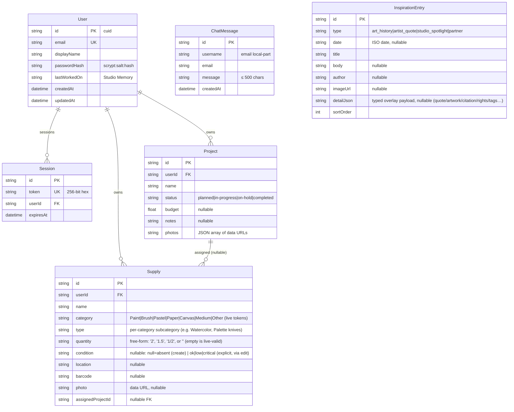

# AST Studio — Master Project Architecture Document (PAD) v1.20

**Classification:** Internal Engineering Reference
**Status:** DEFINITIVE, PRODUCTION-LOCKED BLUEPRINT
**Companion Document:** `README.md` (onboarding), `AGENTS.md` (agent instructions), `CLAUDE.md` (engineering standards)
**Last Updated:** 2026-09-23 (r21)
**Audience:** Senior Engineers, Tech Leads, DevOps, and Onboarding Engineers
**Rule:** Every architectural decision in this document traces to a specific rationale.
Nothing is here "because it's popular."

#### Revision Block — v1.5 (Tracked Changes)

- `[SYN]` Initial PAD generated alongside the v1.0 codebase — every section
  verified against the actual source tree and executed commands on
  2026-09-16 (lint/typecheck green; golden paths browser-verified).
- `[R2]` Session-3 parity remediation (2026-09-16): live data vocabulary
  (Paint/Brush/… categories, ok/low/critical conditions, per-category
  subcategories), supply/project detail panels with Delete, stock filter
  tabs, supply assignment, byte-compatible export/import wire format,
  photo validation fix, active-stat fix, mobile "Chat ☰" toggle, sign-in
  rate limiting, action-layer tests (82 total), CI verify-gate workflow.
  All sections re-verified against the source tree and the live app.
- `[R3]` Session-5 visual parity remediation (2026-09-17): glass-card
  12-column shell (sidebar/main/chat as rounded-3xl cards with per-panel
  accent borders on the blurred `#0B0018` canvas), corrected brand tokens
  (purple `#5b3fd3`, yellow `#f4f27a`, coral `#ffe0cc`, orange `#ffb85c`,
  bg-primary/secondary, cyan/lavender/warm glow shadows), per-view chrome
  (turquoise projects, pink supplies), bundle-extracted status pill/chip/
  condition style maps in `studio-domain.ts` (97 tests total), rows-of-3
  chip grids with in-row detail panels, gradient quote tiles, plain-purple
  chat avatars, native-alert import feedback, Inter wired via
  `@theme inline` (fixes a silent system-font fallback), themed scrollbar
  rails. Verified by VLM screenshot comparison of all four views against
  the live site plus a 16-check functional smoke suite.
- `[R4]` Session-7 visual parity remediation (2026-09-17): brand tokens
  re-pinned to the live bundle's compiled utility ground truth (purple
  `#5a3a8e`, yellow `#ffd5a8`, coral `#ff7a7a` — the live `:root`
  variables for those three are vestigial; pinned by the new
  `design-tokens.test.ts` so the trap cannot recur); edit flows rebuilt as
  INLINE panels (`project-edit-panel.tsx` / `supply-edit-panel.tsx`) that
  swap the detail panel in place (create stays a centered dialog), with the
  live forms' exact structure (Planned-first status order in edit, budget
  default 0, custom-subcategory block, Add-to-Project chip); login
  restyled to the live Amplify chrome (sharp `#120724` card, 1px `#5B3FD3`
  border, `#047d95`/`#304050` tabs, 4px inputs, `#FE5FA7` primary);
  Other/Custom free-form subcategory flow (schema relaxed to live parity —
  pickers are the vocabulary guard); exports emit unset budget/barcode as
  `""` plus `imageUrl: null` in the live field order; shared photo
  downscale helper extracted to `photo-data-url.ts` (109 tests).
- `[R5]` Session-8 robustness + parity remediation (2026-09-17):
  `normalizedImportPayloadSchema` now actually gates the import path
  (§6.1's documented bounds are enforced: ≤500 projects / ≤1000 supplies,
  string lengths, photo caps, vocabulary enums); the import restore is one
  interactive `db.$transaction` (a mid-import failure rolls back instead
  of emptying the studio); supplies post-create navigation parity
  (away-and-back → category grid, re-click keeps the sub-view —
  verified against the live app); "All <Category>" breadcrumb and
  empty-state parity (no `__all__` segment, tabs hidden on empty lists,
  no create button in the filtered-empty state); `inert` on closed
  drawers; one chat poller per viewport; `pickToday` dedupe;
  `scripts/smoke_functional.py` (17-check browser smoke suite);
  121 tests total.
- `[R6]` Session-9 focus-flow parity remediation (2026-09-17): the
  Recent Projects rail now focuses a project exactly like the live app
  (a sticky `{ id, key }` focusRequest in `StudioApp` — every
  projects-view mount opens the "All Projects" list with that project's
  detail panel, sticky across away-and-back and the breadcrumb reset;
  bundle-extracted from the live `Lz`/`HB` components and DOM-verified
  three times against the deployed app); the inspiration rail carries
  per-navigation sections (`resolveInspirationFocus` in
  `src/lib/inspiration.ts` — "art-history-today" / "partner" auto-expand
  their Feed panels, while "quote" and the hardcoded
  "spotlight-kevin-lewis" are the live's inert sections, pinned by
  tests); the dashboard's Studio Spotlight card navigates to the Feed
  (the live's dead spotlight section — scroll, no panel); a plain INSPO
  stat-tile click never expands nor collapses a panel (live-verified);
  131 tests + 23 smoke checks; the live account was found with leftover
  parallel-session test data and restored to the reference pristine
  state (PROJECTS 0 / SUPPLIES 0).
- `[R7]` Session-10 seed-fidelity pass (2026-09-17): a fresh
  full-surface recon (four-view + mobile VLM comparison of the live app
  vs the clone — parity across the board; all 15 inspiration entries,
  chat timestamps, and detail-panel content byte-verified against the
  live DOM; 23/23 smoke checks and all gates green on the pushed tree)
  surfaced one residual gap: the seeded community chat had silently
  "corrected" two of the live author's typos. `scripts/seed.ts` now
  mirrors the live messages byte-for-byte ("hi This is KIm…",
  "It's a brower app…"), guarded by the new `seed-fidelity.test.ts`
  (the file-content test pattern established by `design-tokens.test.ts`)
  so the typos cannot be silently re-"fixed"; 134 tests total. The live
  carries an operator-account test message ("Hello from clone test",
  Sep 16 — prior-agent residue) that has no delete affordance in the
  live UI and is deliberately NOT part of the seeded community content.
- `[R8]` Session-11 pixel-parity pass (2026-09-17): post-hydration DOM
  recon (the live renders DIFFERENT pre-hydration markup — its logo
  hydrates from a 320×81 inline-styled img to responsive classes; only
  steady-state measurements are ground truth) closed the final visual
  gaps: the header logo now passes the file's intrinsic 1068×269 aspect
  with the `h-10 md:h-12 lg:h-14 w-auto max-w-[320px] object-contain`
  classes and no inline style (header 88px desktop / 126px mobile — was
  113px with every panel shifted 25px); the radius scale is the live's
  Tailwind-v3 defaults (`rounded-lg`/`xl` = 8/12px — the shadcn scaffold
  had 16/20px); the app ships ZERO webfonts (the live's
  `document.fonts` is empty — its InterVariable stack resolves to system
  fonts; the clone's self-hosted next/font Inter had wider advance widths
  that re-wrapped the Studio Memory text and inflated header pills); the
  chat panel is split into the live's `sticky top-4` community header +
  `max-h-[calc(100vh-16rem)]` scroll container (the sticky displacement
  is load-bearing — all community rows now sit at the live's exact
  coordinates); the chat's stickToBottom auto-scroll was removed (the
  live bundle has no scroll logic); login Amplify chrome completed — the
  eye toggle as the input's right segment (1px #89949f y/r borders,
  0-4-4-0 radii, near-invisible #0d1a26 icons), #9ca3af placeholders,
  the invisible-typing #0d1a26 input text quirk (pixel-verified by
  typing into the live field), the 2px gray/turquoise tab-strip top
  border, the mobile h1 leading 1.25, and `deriveDisplayName` replacing
  the live's absent display-name field. Pinned by the new
  `login-fidelity.test.ts` and `chat-fidelity.test.ts` (file-content
  pattern) plus the extended `design-tokens.test.ts`; 180 tests total,
  23 smoke checks, VLM parity on all four views and the login page at
  both viewports.
- `[R9]` Session-13 error-state pass (2026-09-17): a fresh full-surface
  recon (17 VLM comparisons — desktop/mobile views, the mobile sidebar
  drawer, login at both viewports — plus DOM spot-checks: header 88px /
  126px, logo 222×56 / 159×40, chat structure rows, tab strip, password
  row — all byte-identical) confirmed the r8 tree at parity, then an
  error-state deep-dive closed the auth-error chrome: SERVER auth errors
  (bad credentials, duplicate email, invalid reset code) now render in
  the live's Amplify alert box (div[role=alert], flex row, 16px gap,
  px-4 py-3, bg #FCE9E9, content-driven height 58/72px, the exact 24px
  warning-icon and 16px X-icon SVG paths, a working 50×34 "Dismiss
  alert" button — measured byte-identical at (527,702) 414×58 desktop
  and (49,778) 292×72 mobile); signup CLIENT validation renders the
  Cognito password-policy stack (one contiguous 24px line per violated
  rule — 8 chars / upper / lower / number / special, ALL violations at
  once via `passwordPolicyViolations` in `src/lib/validation.ts`,
  coexisting with the "Your passwords must match" line; both stacks
  DOM-verified identical incl. the centered-card re-settling shift);
  the duplicate-email copy is the live's exact "User already exists";
  the Reset Password flow is complete (Send code with a valid email →
  the confirmation view: Code * / New Password / Confirm Password /
  Submit / Resend Code — card 480×485 with every element at the live's
  coordinates; Submit answers with the live's "Invalid verification
  code provided, please try again." because no mailer exists so no code
  can ever be valid — the honest simulation; Resend is a silent no-op;
  the r8 static support notice is gone); the auth forms use native
  browser validation (password inputs `required`-only, matching the
  live's attribute set) and `signInSchema` never policy-checks (the
  live submits short passwords and answers "Incorrect username or
  password."); the link buttons are content-width 35px centered
  (Forgot 182px, Back to Sign In 127px, Resend Code 115px — the r8
  51px forgot pin was a pre-hydration artifact). Pinned by the extended
  `login-fidelity.test.ts` + `validation.test.ts`; 202 tests total,
  23 smoke checks, all gates green.
- `[R10]` Session-15 drawer-scrim pass (2026-09-18): a fresh recon on the
  r9 tree (9 VLM comparisons of the desktop views, the mobile views, the
  drawers, and the login page at both viewports — plus DOM spot-checks:
  header 1920×88 + logo 222×56, the desktop chat structure rows
  (Community 1620/121, hi 1669/414, brower 1669/632, testing 1669/818),
  the memory popover (1620,185) 267×66, the desktop login card
  (494,464) 480×429, chat timestamps, and a live export-payload capture
  (byte-identical `app`/`version`/`projects`/`supplies` shape) — all at
  parity) surfaced one residual chrome gap: the mobile drawer scrim. The
  live renders ONE shared scrim — `fixed inset-0 z-40 bg-black/60
  md:hidden` — a plain 60% dim with NO backdrop blur, stacked below the
  z-50 drawers, and mounted/unmounted instantly (measured at click-time:
  the scrim is gone while the drawer is still mid-slide). The clone had
  `backdrop-blur-sm` on the scrim (visibly blurring the underlying page —
  VLM flagged it unprompted), z-50 (same layer as the drawers), and a
  `transition-opacity` fade on the sidebar's scrim. Fixed in
  `studio-app.tsx` + `studio-sidebar.tsx` (the sidebar scrim also became
  conditionally mounted, matching the live's unmount behavior) and
  pinned by the new `drawer-fidelity.test.ts` (7 pins). Two accepted
  divergences re-confirmed and documented: the mobile login card's 0.5px
  fractional offset (the live's 357px card centers in its 358px content
  column — Amplify internal responsive layout; desktop identical) and the
  live chat's prior-agent residue message (the mobile chat input sits
  78px lower on the live purely from that extra row). 209 tests total,
  23 smoke checks, all gates green, VLM PARITY on the fixed drawer
  pairs.
- `[R11]` Session-17 supply-contract pass (2026-09-19): a fresh recon
  re-confirmed every steady-state surface at parity (8 VLM comparisons —
  desktop views + the production build's dashboard + mobile + both
  drawer pairs; DOM spot-checks — header 1920×88, logo 222×56, chat rows
  byte-identical, login card 480×429 @ (494,464), drawer scrims and
  geometry identical; a pristine-state export capture byte-identical;
  production build verified zero-webfont with no dev-tools badge — the
  dev-mode Geist faces and "N" indicator never ship). A functional
  deep-dive against the live (create/edit/export/import probes, every
  probe supply deleted, the live account left pristine) then closed two
  HIGH-severity gaps in the supply contracts. QUANTITY (r11-F1): the
  live accepts an EMPTY quantity — stores "", renders the bare "qty"
  chip label and a blank detail value, exports `qty:""` /
  `quantity:null` / `quantityValue:null`; it validates the FORMAT
  (unparseable text rejected with the exact copy "Enter a valid
  quantity, like 2, 1.5, or 1/2"); its fraction exports carry
  `quantity:null` (the plain `Number()` parse — no fraction support);
  and its import round-trips `qty:""` verbatim. CONDITION (r11-F2):
  the live's create-modal Stock Status select is INERT (a supply created
  with "Low" selected still stores no status); an ABSENT status renders
  the "?" pill + unlabeled "⚠️" detail glyph and is omitted in export,
  while an EXPLICIT "ok" (saved through the edit panel) renders the
  cyan "OK" pill (`bg-ast_cyan/15 text-ast_cyan`) + "✓ ok" icon
  (`bg-ast_turquoise/20 text-ast_turquoise`) and exports `status:"ok"`;
  the import preserves the distinction. Remediated via TDD:
  `Supply.condition` became nullable (null = absent; the modal submits
  null, the edit panel initializes `?? "ok"` and saves explicitly), the
  quantity format gate landed in `isValidQuantityInput` + the Zod
  boundary, the export/import wire format was re-pinned to the measured
  three-slot semantics, and the chip/detail rendering matches the live
  byte-for-byte (browser-verified). Also: `deleteProject` became atomic
  (detach + delete in one transaction — a mid-delete failure can no
  longer strand supplies), the README's stale `next/font` Typography
  paragraph was corrected to the zero-webfont contract, and two r10-era
  observations were documented as accepted (the nav-vs-aside drawer
  landmark; the dev-mode-only badge/fonts). Pinned by 20 new/adjusted
  tests incl. the new `supply-fidelity.test.ts` (6 source pins);
  229 tests, 23 smoke checks, all gates green.
- `[R12]` Session-18 stat-tile accent pass (2026-09-19): a fresh recon
  on the r11 tree (8 paired screenshot comparisons — the initial stale
  captures' VLM "GAP" flags were traced to timing artifacts and
  session-state residue; re-verified with fresh captures — plus a
  pixel-level structural diff and DOM computed-style probes at both
  viewports; a pristine-state export capture re-confirmed byte-identical)
  found ONE real divergence (r12-F1): the sidebar's ACTIVE stat tile.
  The live highlights the active view's tile with that tile's OWN
  accent pair — electric blue (`/60` border + `/10` tint) for Projects
  and Supplies, LAVENDER for Inspo — and DROPS the `#120724` card
  background and hover classes while active (inner text classes stay
  constant across states; the contract is identical in the desktop
  sidebar and the mobile drawer; geometry 106×78 @ (257,173) on both).
  The clone had hardcoded electric blue for all three — visibly wrong
  on the Inspiration view. Remediated via TDD: `StatCard` takes a
  per-tile `activeClass` prop, pinned by the new
  `sidebar-tile-fidelity.test.ts` (9 source pins — active pairs per
  tile, the dropped card bg/hover, constant inner text, and a negative
  pin on the old hardcoded string). Post-fix evidence: the stat-tile
  regions diff at 0.00% hot pixels on both the desktop inspiration
  view and the mobile drawer; every remaining diff classified into the
  documented accepted set (the live's residue chat message — the 78px
  chat-drawer delta re-measured at 928 vs 850 scrollHeight; the
  dev-mode-only Next.js badge; sub-perceptual oklab-vs-rgba compositing
  and fractional text-row rounding — the Partners card body lands
  0.69px lower on the clone, a 1px glyph-row shift). Production build
  verified: the lavender classes present in the emitted CSS, the
  active Inspo tile rendering lavender on the production server, zero
  webfonts, no dev badge. 238 tests, all gates green.

- `[R13]` Session-20 hover/hyphen-family pass (2026-09-19): a fresh
  full-surface recon on the r12 tree (8 paired VLM comparisons + pixel
  structural diffs — all PARITY after correcting two capture-state errors
  of the operator's own making; the export wire re-confirmed byte-identical
  at 121 bytes; the sign-out flow probed on both sides; 23/23 smoke checks)
  found two real divergences, both surfaced by a memory-popover probe.
  r13-F1: the live app carries TWO parallel Tailwind color families — the
  UNDERSCORED utilities (`ast_purple` #5a3a8e / `ast_yellow` #ffd5a8, which
  every other surface uses and our @theme tokens pin) and HYPHENATED
  families (`ast-purple` / `ast-yellow`) that exist ONLY on the header's
  memory button and resolve to the live's `:root` variable values
  (#5b3fd3 / #f4f27a — the "vestigial" block is NOT dead after all).
  The clone had copied the button's class string verbatim, resolving its
  hyphenated classes to the UTILITY values — the wrong idle border color
  (always visible) and all three hover colors. Fixed with literal
  arbitrary values (`border-[#5b3fd3]/30`, `hover:border-[#f4f27a]/70`,
  `hover:bg-[#f4f27a]/20`, `hover:text-[#f4f27a]`) — the emitted fallback
  rules are byte-identical to the live's four rules; the lab() progressive
  re-declarations render identical pixels (canvas-verified). r13-F2:
  Tailwind v4's default hover variant is wrapped in `@media (hover: hover)`
  while the live's TW3 compiles plain `:hover` selectors — on touch devices
  the live's hover tints apply and stick on tap while the clone's never
  engage, and in headless captures the clone's hovers never render
  (unverifiable). globals.css now overrides the variant
  (`@custom-variant hover (&:hover);`) restoring the live's semantics —
  hover parity became directly verifiable, and the paired popover capture
  (pointer resting on the button on both sides) now shows both buttons
  hovered in the live's #f4f27a/20 with the popover region at 0.00% hot
  pixels and the button interiors sample-identical. Both fixes pinned by
  the new `header-button-fidelity.test.ts` (9 pins); the theme comment's
  disproven "dead values" claim corrected in place. A fresh set of 8
  dev-server screenshots landed in `docs/screenshots/` as the visual
  reference. 247 tests, all gates green, production build + production-
  server probe verified (literal classes, hover values, zero webfonts, no
  dev badge).

- `[R14]` Session-22 default-palette pin pass (2026-09-19): a fresh
  full-surface recon on the r13 tree (8 paired VLM comparisons + pixel
  structural diffs at the identical r13 values — 0.23–1.14% hot, every
  cluster in the documented accepted set; the export wire byte-identical
  at 121 bytes; 23/23 smoke checks; the r12 stat-tile and r13 memory-
  button/hover-variant fixes verified intact) plus a NEW probe dimension —
  a systematic DOM-level hover-contract sweep across both sessions (the
  probe class that found r13-F1, now extended to every interactive
  element). The sweep surfaced one real divergence (r14-F1): the app uses
  Tailwind DEFAULT palette classes on seven surfaces (the Sign Out
  button's `border-pink-400/60` + `text-pink-200` + `hover:bg-pink-500/20`,
  the memory button's `text-pink-300`, the header email gradient's
  `from-cyan-400 via-blue-500 to-pink-500`, the barcode fields' blue focus
  trio, the chat error alert's `text-pink-300`) — and Tailwind v4
  re-derived its default palette in oklch, so those classes resolved
  values that drift from the live's Tailwind v3 palette (pink-400
  #fb64b6 vs the live's #f472b6 — a 14/channel delta on the always-visible
  Sign Out border; cyan-400 #00d2ef vs #22d3ee — 34 in the red channel;
  blue-500 #3080ff vs #3b82f6; pink-500 #f6339a vs #ec4899; the drift was
  sub-threshold in screenshot diffs (Δ22 summed vs the 30 threshold) —
  the same "invisible in captures" class as r13-F1's hovers). Fixed by
  pinning the seven default-family tokens to the live's v3 values in the
  `@theme` block (spike-verified first: a user @theme override REPLACES
  TW4's default emission entirely — single declaration, no lab()
  re-declaration — and the baked fallback rules become byte-identical to
  the live's compiled rules: `.border-pink-400\/60` → `#f472b699`,
  `.border-blue-500\/40` → `#3b82f666`). The usage sites KEEP the live's
  class strings verbatim (class-string parity — the pins make the default
  families safe; no literals needed). Verified at CSS (dev + production
  builds carry the pinned rules), computed-style (text/gradient stops
  byte-identical rgb forms), and rendered-pixel level (canvas readback
  maxd=0 for every token pair, including the oklab hover forms). Pinned
  by 13 new design-tokens tests (7 positive token pins + a TW4-drift
  negative + 5 usage-site class-string pins). 260 tests, all gates green;
  the 8 `docs/screenshots/` re-shot on the remediated tree.

- `[R15]` Session-24 focus & keyboard-contract pass (2026-09-19): a fresh
  full-surface recon on the r14 tree (8 paired VLM comparisons — 8/8
  PARITY; pixel structural diffs at the identical r13/r14 values, every
  cluster in the documented accepted set; the export wire byte-identical
  at 121 bytes; 23/23 smoke checks; the r12 stat-tile, r13
  memory-button/hover-variant, and r14 default-palette fixes verified
  intact) plus the NEXT unexplored probe dimension — a systematic
  keyboard/focus-state contract sweep (DOM tab-order enumeration,
  computed focus styles, rendered ring pixels, Escape/focus-management
  probes on the modals and drawers). Two real divergences found, both in
  the "invisible in pointer-driven captures" class (like r13-F1's
  hovers). r15-F1: the shadcn scaffold's base rule authored a universal
  turquoise/50 focus-outline color (`* { @apply border-border
  outline-ring/50 }`) — every keyboard-focused button/tile/link rendered
  a bright turquoise ring, while the live's compiled CSS carries no
  universal outline-color rule at all (its only outline rules are TW3's
  transparent focus:outline-none utility and Amplify's login chrome), so
  its elements render the BROWSER DEFAULT ring (computed rgb(16,16,16)
  in Chromium — canvas-verified divergence: the clone's ring band was
  #2ec4b6 at 50% over the dark canvas, 496 hot px in the Sign Out
  crop). Fixed by removing outline-ring/50 from the base rule (the inert
  border-border stays); the focused Sign Out ring now renders 0 hot px
  with byte-identical band pixels, and the production build's rendered
  behavior was probed on a production server (outline rgb(16,16,16),
  zero webfonts, no dev badge). r15-F2: the clone's create modals had
  added an Escape-close keydown handler and an initial focus steal into
  the first input — the live's modal has NO keyboard affordances
  (measured: focus stays on the trigger button, Escape does nothing,
  only the X button and the scrim click dismiss). Both removed;
  role="dialog" + aria-modal stay (invisible semantics — the
  drawer-landmark precedent). Tab order verified identical (24
  tabbables in the same DOM sequence on both sides); the chat input's
  focus border re-verified byte-exact (rgb(46,196,182)); the mobile
  drawers ignore Escape on both sides. Pinned by the new
  focus-fidelity.test.ts (11 pins: the base-layer negative, the
  border-border positive, the docblock marker, and 8 modal-contract
  pins). 271 tests, all gates green; the 8 docs/screenshots/ re-shot on
  the remediated tree.
- `[R16]` Session-26 verification hardening (2026-09-22): a full-session
  audit against the live (8 paired VLM comparisons at the documented
  baselines, 23/23 smoke, the mobile drawer contract re-verified) found
  visual parity intact and closed three TOOLING-side gaps. r16-F1
  (HIGH): the SQLite path was runtime-dependent — Prisma's CLI and
  Node-side tooling resolve a relative `file:` URL against the CWD (the
  DB silently landing OUTSIDE the repo) while the bun runtime resolves
  it schema-relative — so the documented `file:../db/custom.db` contract
  was nondeterministic. The new `src/lib/db-path.ts` layer pins ONE
  contract (relative file: URLs resolve against `prisma/schema.prisma`
  via a module-anchored + CWD-walking schemaDir; absolute and non-file
  URLs pass through unchanged for the action layer's temp DBs; repo
  tooling prefers the repo's OWN .env over an inherited absolute
  DATABASE_URL so a workspace shell cannot relocate the database),
  wired as PrismaClient's `datasourceUrl` in `db.ts` + the seed, and as
  a `DATABASE_URL="$(bun scripts/prisma-url.ts)"` prefix on the
  db:*/dev/start scripts (12 new tests). r16-F2 (HIGH): the Playwright
  E2E suite (`playwright.config.ts` + 8 spec files, 25 specs) — a setup
  project signs in ONCE and saves a storageState (the sign-in rate
  limiter is a pinned contract), a desktop chromium project at the
  1536×844 parity viewport, and a mobile-chromium project at 390×844
  pinning the live's drawer contract (geometry, shared scrim, inert,
  Escape no-op, Chat toggle); serial single-worker over the one shared
  SQLite; every created row deleted through the real UI. CI gained an
  `e2e` job (chromium install → db:push + db:seed → test:e2e). r16-F3
  (MEDIUM): the verify-gate workflow's `branches:` lists were corrupted
  (`ain]` → invalid YAML, the gate silently broken) — repaired to
  `[main]`. Also: `db:seed` runs under plain `bun` (no network-fetched
  tsx), `.env.example` corrected to the real test path, .gitignore
  covers e2e/.auth/ + test-results/, and the 8 docs/screenshots/
  re-shot (7/8 pixel-identical to the parity references). 283 vitest +
  25 E2E, all gates green.
- `[R17]` Session-28 motion-contract pass (2026-09-23): a fresh
  full-surface recon on the r16 tree (8 paired captures at or below the
  documented baselines, export envelope byte-identical modulo its
  timestamp, 23/23 smoke) plus THREE new probe dimensions — print
  stylesheets (0 `@media print` rules on both sides: parity), live
  regions (the clone's chat `role="log"` re-confirmed as the documented
  intentional WCAG improvement; the login alert chrome pinned
  byte-identical since r9), and the motion contract. The motion sweep
  found ONE real divergence (r17-F1, Medium): the scaffold's
  `@keyframes studio-fade-in` + `.studio-fade` played a 300ms
  fade-and-translate entry animation on THIRTEEN surfaces (every view
  switch, detail/edit panel swap, modal mount, and the login card) while
  the live renders every studio surface instantly (CSSOM keyframes all
  Amplify-internal; view wrappers and modals compute `animation: none`;
  zero animating elements at steady state) — invisible in steady-state
  pixel diffs since the initial scaffold commit, the same class as
  r13-F1's hovers and r15-F1's focus ring. Removed the keyframes, the
  utility rule, the ironic `prefers-reduced-motion` guard, and all 13
  usage-site class references; the drawers' `transition-transform
  duration-300` slide and the 0.15s hover tints stay (the live's real
  motion contract, re-probed at parity). Verified at CSSOM,
  computed-style, and animating-element level (zero animating elements
  at mount and steady state; modal `animationName: none`); post-fix
  paired capture at 0.34% baseline; the 8 docs/screenshots/ re-shot
  (0.00% vs the r16 parity-verified references). New
  `motion-fidelity.test.ts` (18 pins incl. the drawer-transition
  positive guards). Also accepted-documented: the modal scrim's
  z-[60] (live: z-50) is unreachable — the drawer always closes before
  a modal opens (probed on both sides); the TW3/TW4 `transition`
  utility's property-list difference is internal-only (every
  hover-changed property is in both lists). 301 vitest + 25 E2E, all
  gates green.
- `[R18]` Session-30 reading-order & a11y-structure pass (2026-09-23):
  a fresh full-surface recon on the r17 tree (8 paired captures at or
  below the documented baselines — dashboard 0.53%, projects 0.39%,
  supplies 0.39%, inspiration 0.54%, mobile-dashboard 0.17%, sidebar
  drawer 0.47%, chat drawer 0.76%, login 0.21%, every cluster
  decomposed to the accepted set: account email, dev badge, the quote
  card's viewport-edge second line with byte-identical geometry on both
  sides, and the scrollbar-thumb delta from the live's residue chat
  message below the fold; export envelope byte-identical modulo
  timestamp; 23/23 smoke) plus the three session-28-suggested probe
  dimensions. Zoom/reflow: PARITY — zero horizontal overflow on both
  sides at 200% zoom equivalent (640×400) and 320px width (WCAG
  1.4.10), capture diffs 0.58%/0.05%. Forced-colors: PARITY — zero
  forced-colors/prefers-contrast/inverted-colors rules in either CSSOM.
  Reading order: the announcement order (header → sidebar → content →
  chat) is identical on both sides at both viewports (probed on the
  dashboard and the inspiration Feed), with three findings in the
  invisible-semantics/documentation class. r18-F1 (Docs, Medium):
  session_26 had misattributed the closed drawers' `inert` as
  live-measured — direct probe shows the live's closed drawers carry
  NEITHER `inert` NOR `aria-hidden` (10 sidebar + 3 chat focusable
  descendants off-screen but tabbable and announced, its mobile reading
  order walking the drawer content before the page); the clone's
  `inert` + `aria-hidden` pair is the kept r5 improvement — the record
  corrected, the pair pinned at source level, no code change. r18-F2
  (accepted): the live nests an inner `<main>` around its content pane
  (two main landmarks — invalid HTML); the clone's single-`<main>` +
  `<section>` structure kept. r18-F3 (accepted): the live renders twin
  md-toggled content copies (one always `display:none`); the clone
  renders one responsive copy — invisible in pixels and the a11y tree.
  Also fixed: §5.4's stale motion bullet still described the removed
  studio-fade keyframe (an r17 miss) — rewritten to the r17/r18
  contract. New `landmark-fidelity.test.ts` (9 characterization pins,
  green on arrival). 310 vitest + 25 E2E, all gates green.
- `[R19]` Session-32 CSS compile-hygiene pass (2026-09-23): a fresh
  full-surface recon on the r18 tree (8 paired captures at or below
  the documented baselines — dashboard 0.34%, projects 0.34%, supplies
  0.34%, inspiration 0.49%, mobile-dashboard 0.17%, sidebar drawer
  0.47%, chat drawer 0.76%, login 0.17%; export envelope byte-identical
  modulo timestamp; 23/23 smoke) plus the three session-30-suggested
  probe dimensions, all at PARITY: caret/::selection/::placeholder
  rendering (probed input-by-input on both sides — caret white,
  ::selection transparent → UA default, placeholder white/40, the photo
  input's lavender chrome identical; the clone's oklab-serialized alpha
  composites verified numerically equal to the live's rgba values),
  `prefers-contrast: more` emulated rendering (zero authored rules in
  either CSSOM under active emulation; paired captures at the standard
  baselines — desktop 0.34%, mobile 0.17%), and the devicePixelRatio
  matrix (dpr1 0.34%, dpr2 0.40% — 2x text rasterization, within the
  accepted envelope). TWO real findings fixed. r19-F1 (HIGH, compile
  hygiene): Tailwind v4's automatic content detection scanned the
  committed `skills/` folder — violating the repo's
  skills-excluded-from-compilation contract — leaking class-like
  strings from skill docs into the compiled CSS as dead rules (the
  gift-evaluator skill's HTML template contributed two red-tinted
  ::selection rules) and inflating the stylesheet 37% (300,314 →
  189,577 bytes dev; 3,147 → 1,922 CSSOM rules vs the live's 1,442);
  fixed with `@source not "../../skills";` in globals.css, rendering
  verified 100.00% identical. r19-F2 (MEDIUM): the shadcn Input
  scaffold's selection utilities (bg-primary / text-primary-foreground)
  — dead while unused but divergent the moment consumed, since the live
  authors zero ::selection rules — stripped from
  `src/components/ui/input.tsx`; the compiled CSS now carries zero
  ::selection rules. Also r19-M1 (methodology): the live's Vite SPA
  applies styles asynchronously in fresh headless contexts (the first
  Playwright paired run measured 5.19% until decomposed: live-vs-live
  across browser contexts 4.97%, clone-vs-clone 0.00% — the clone
  renders deterministically across engines); fresh-context captures now
  gate on a paint-settle condition. New `css-hygiene.test.ts` (5 pins,
  TDD red→green verified via git-stash of the fixes). 315 vitest +
  25 E2E, all gates green, production build + production CSS verified.
- `[R20]` Session-34 media-contract pass (2026-09-23): a fresh
  full-surface recon on the r19 tree (8 paired captures at or below the
  documented baselines — dashboard 0.38%, projects 0.37%, supplies
  0.37%, inspiration 0.53%, mobile-dashboard 0.17%, sidebar drawer
  0.47%, chat drawer 0.76%, login 0.17%; export envelope byte-identical
  modulo timestamp; 23/23 smoke; drawer geometry byte-identical) plus
  the three session-32-suggested probe dimensions.
  `forced-colors: active` emulated rendering: captures at PARITY
  (desktop 0.35%, mobile 0.14%) — but the probe's CSSOM media-rule
  sweep surfaced r20-F1: the clone's compiled CSS carried SIX
  `@media (forced-colors: active)` rules (TW4's forced-colors-aware
  transparent-outline utility, emitted from the unused shadcn
  scaffold's class strings) while the live authors zero — the 29
  scaffold tokens stripped (dev CSS 189,849 → 188,388 bytes;
  production CSS 153,077 → 152,241 with 0 forced-colors rules;
  rendering unchanged, all 8 screenshots byte-identical).
  `prefers-reduced-transparency: reduce` (raw-CDP engaged —
  Playwright's emulateMedia option silently fails in this environment,
  matchMedia verified true on both sides): PARITY — 0.34%/0.17%, zero
  authored rules in either CSSOM. Firefox engine matrix (WebKit cannot
  launch in the sandbox — missing GTK system libraries): PARITY — 8/8
  paired surfaces at/below the Chromium baselines, 0.00%
  cross-context determinism on BOTH sides, and the ~7.7% cross-engine
  delta is symmetric (live 7.83% / clone 7.71% — engine font
  rasterization shifts both sides equally). Decomposing the CSSOM
  media-class inventory also surfaced the login chrome's transition
  contract (r20-F2): the live's login elements compute `transition:
  all 0.25s ease` (inactive tabs, inputs, eye toggle, submits, link
  buttons, the alert's Dismiss) with `transition-property: none` on
  the ACTIVE tab, and `.amplify-button { transition: none }` under
  `prefers-reduced-motion: reduce` (the r17 "no reduced-motion guard"
  record was incomplete — its inventory counted @keyframes only; the
  live carries five reduced-motion MEDIA rules, four of them dead on
  both sides and documented as accepted divergences); the clone had
  the TW utility's 0.15s fades and no guard — fixed with
  `transition-all duration-[250ms] ease-[ease]` everywhere measured
  (computed byte-identical to the live, verified per element — note
  the arbitrary-value `ease-[ease]`: TW4 has no bare `ease` utility
  and silently falls back to its cubic-bezier default), the ACTIVE-tab
  override, and the scoped `.ast-amplify-button` guard. Plus r20-F3:
  the live's login submit holds its label/enabled/opacity CONSTANT
  through the auth round-trip (measured at 120ms intervals) — the
  clone's "Signing in…" swap and disabled dim removed. 13 new pins
  (css-hygiene extension + the new `login-motion-fidelity.test.ts` +
  the refined r17 motion pin). 328 vitest + 25 E2E, all gates green,
  production build + production CSS verified.

- `[R21]` Session-36 app-shell height pass (2026-09-23): a fresh
  full-surface recon on the r20 tree — 8 paired captures re-derived
  with a self-consistent hot-pixel metric (sum of channel deltas >
  30), export envelope byte-identical, 23/23 smoke, drawer geometry
  byte-identical — surfaced ONE structural finding (r21-F1, HIGH):
  the live's desktop app shell is UNCAPPED (its grid row sizes to the
  chat column's intrinsic content — sticky header 240 + the scroll
  container's max-h calc 588 + padding = 878px — so the page grows to
  982 at 1536×844 and the window scrolls, wheel-verified 0→138), while
  the clone carried the scaffold's viewport-height cap from the initial
  commit (never live-measured): the page was locked at 844, the chat
  card clipped at 740px with its bottom border rendered where the
  live's card continues past the fold, and the wheel scroll was dead.
  The cap token was removed — the clone's geometry now matches the
  live's numbers exactly (verified on dev AND production servers) and
  the desktop captures dropped below every baseline. The second
  finding (r21-F2, MEDIUM): the r19/r20 selection/forced-colors
  remediations had been regressed by their own documentation — TW4
  scans committed markdown, and the stripped tokens quoted verbatim in
  the session records recompiled as dead rules (152,241 → 152,390
  bytes); all 13 occurrences reworded and pinned by a new docs-token
  scan (production CSS 152,062 bytes — cleaner than the r20 record).
  Mobile verified byte-stable (no mobile change; the reference
  re-shoot differs from the r20 references only by environment-level
  sub-pixel text rasterization — content VLM-verified identical).
  5 new pins (`layout-fidelity.test.ts` + the css-hygiene docs-token
  extension). 333 vitest + 25 E2E, all gates green, production build
  + production CSS verified.

---

## Table of Contents

1. [System Overview & Decisions](#1-system-overview--decisions)
2. [High-Level System Topology](#2-high-level-system-topology)
3. [Application Architecture](#3-application-architecture)
4. [Data Architecture](#4-data-architecture)
5. [Design System Reference](#5-design-system-reference)
6. [Security Architecture](#6-security-architecture)
7. [Testing Strategy](#7-testing-strategy)
8. [Build & Deployment](#8-build--deployment)
9. [Developer Handbook](#9-developer-handbook)
10. [Known Issues & Outstanding Tasks](#10-known-issues--outstanding-tasks)
11. [Key Files Reference](#11-key-files-reference)
12. [Glossary](#12-glossary)

---

## 1. System Overview & Decisions

### 1.1 Document Metadata & Purpose

AST Studio is a full clone of the Art Supply Tracker artist beta
(`studiobeta.artsupplytracker.com`) — a studio assistant for artists with
projects, supplies, an inspiration feed, and community chat. The original is
a Vite React SPA backed by AWS Amplify (Cognito authentication, AppSync
GraphQL data). This codebase reproduces the product on a self-contained
Next.js stack. Use this PAD to understand why each seam exists, to extend the
app, or to replicate the architecture elsewhere.

### 1.2 Technology Stack Summary

| Layer | Technology | Version | Key Rationale |
|---|---|---|---|
| Web framework | Next.js (App Router) | 16.1.3 | RSC-first rendering with server-side session resolution; single-route contract satisfied by one `page.tsx` |
| UI runtime | React | 19.2.3 | Only runtime Next 16 supports without shims; RSC + client islands |
| Language | TypeScript | 5.9.3 (`strict`) | Type-safe end to end; DTO discipline enforced |
| Styling | Tailwind CSS + `@tailwindcss/postcss` | 4.1.18 | CSS-first `@theme` tokens reproduce the original palette exactly; no config file drift |
| UI primitives | shadcn/ui on Radix | scaffold set | Accessible dialogs/select primitives without hand-rolling ARIA |
| Database | SQLite | bundled file | Zero-config persistence; adequate for single-studio scale |
| ORM | Prisma | 6.19.2 | Typed queries + schema-as-migration workflow (`db:push`) |
| Validation | Zod | 4.3.5 | Single validation dialect at every action boundary |
| Package manager / runtime | Bun | ≥ 1.3 | Fast installs; runs the dev/prod scripts |
| Lint | ESLint (`next/core-web-vitals` + `next/typescript`) | 9.x | Flat config; scoped to app source via `ignores` |

### 1.3 Architecture Decision Records (ADRs)

**ADR-001: Single-route, client-switched views (not page routes)**

- **Context:** The original app is a React Router SPA with `/dashboard`,
  `/projects`, `/supplies`, `/inspiration` URLs. The deployment contract for
  this codebase exposes exactly one user-visible route.
- **Decision:** One Next.js route (`src/app/page.tsx`) renders either the
  login gate or the `StudioApp` shell; the four views switch via client
  state (`StudioView` union) inside the shell.
- **Rationale:** Satisfies the deployment contract while preserving the SPA
  behavior being cloned; server-side session check happens once per route
  load, and `router.refresh()` re-runs it after auth changes.
- **Consequences:** No per-view URLs (browser back does not move between
  views). Acceptable — matches the beta's behavior closely enough for a
  clone and keeps the auth boundary in one place.
- **Alternatives Rejected:** Four page routes (violates the single-route
  contract); `?view=` search-param routing (adds URL state that must be
  guarded without adding real value here).

**ADR-002: SQLite via Prisma (not PostgreSQL)**

- **Context:** The original persists through AppSync (DynamoDB-backed). A
  clone must run with zero cloud dependencies and minimal ops surface.
- **Decision:** Prisma with the SQLite provider; schema lives in
  `prisma/schema.prisma`; the database file is `db/custom.db` (gitignored).
- **Rationale:** Single-writer studio workloads (one artist, low write
  volume, community chat at demo scale) are comfortably inside SQLite's
  envelope; the schema-as-migration workflow (`bun run db:push`) removes an
  entire migration discipline from a clone that only needs reproducible
  structure. Swapping `provider` to `postgres` later is a schema-only change.
- **Consequences:** No DB CHECK constraints generated (validation is Zod at
  the boundary); no concurrent multi-process writes; no native enums.
- **Alternatives Rejected:** PostgreSQL + Docker (heavyweight for the
   target environment); in-memory/localStorage (loses persistence and
   shared chat).

**ADR-003: Custom scrypt + session-table auth (not NextAuth)**

- **Context:** The original uses AWS Cognito. The clone needs email +
  password sign-in/up/out only — no OAuth, no MFA.
- **Decision:** `src/lib/auth.ts` — scrypt password hashing (Node built-in,
  per-user random salt, `scrypt:salt:hash` storage format, timing-safe
  verification), opaque 256-bit session tokens in a `Session` table, set as
  an httpOnly `ast_session` cookie (30-day TTL, `sameSite=lax`).
- **Rationale:** Smallest correct surface for the requirement; sessions are
  server-revocable (a DB row), unlike stateless JWTs; no third-party crypto
  to vet. Uniform "incorrect email or password" errors prevent account
  probing.
- **Consequences:** No password reset flow (a documented notice points to
  support); no email verification (the original's spam-folder copy is
  preserved but no mail is sent).
- **Alternatives Rejected:** NextAuth v4 (available in the scaffold but
  brings an adapter + provider model unused by this flow); JWT sessions
  (unrevocable within TTL).

**ADR-004: Server Actions as the only mutation surface (no REST/GraphQL)**

- **Context:** The original talks to AppSync GraphQL from the client. The
  clone runs on the same origin with RSC.
- **Decision:** All reads-at-mutation-time and writes flow through Server
  Actions in `src/actions/*.ts`, each returning the `ActionResult<T>`
  discriminated union. The only route handler is the `/api` health probe.
- **Rationale:** Actions are POST-only, same-origin, and type-checked end to
  end — no client fetch layer to drift, no CSRF-style surface, and error
  semantics are enforced by the shared union type (adopted from the
  Scandi Haven commerce-engine pattern).
- **Consequences:** Chat polling calls an action every 5 s (fine at this
  scale); machine callers (webhooks/cron) have no API surface (none exist).
- **Alternatives Rejected:** REST route handlers (requires a client fetch
  layer + serialization drift); tRPC (adds a dependency for one route).

**ADR-005: Chat via 5-second polling (not WebSocket)**

- **Context:** The original's chat is effectively request/response over
  AppSync. The clone needs multi-user message visibility without
  infrastructure.
- **Decision:** `listChatMessages` action polled every 5 s from
  `StudioChat`, skipped when `document.visibilityState !== "visible"`;
  sends optimistically append via the action's returned DTO.
- **Rationale:** Zero infrastructure, matches the original's perceived
  latency class, and the visibility gate keeps background tabs quiet.
- **Consequences:** Up to 5 s staleness for incoming messages; each poll is
  one SQLite read of ≤ 100 rows (sub-millisecond).
- **Alternatives Rejected:** Socket.io mini-service (adds a second process
  + gateway wiring for a beta-scale wall); SSE (still a route handler +
  connection state).

**ADR-006: Photos as client-downscaled data URLs (not object storage)**

- **Context:** The original uploads photos to cloud storage. The clone has
  no storage service.
- **Decision:** The modal components decode the picked file with
  `createImageBitmap`, draw to a ≤ 1024 px canvas, encode JPEG q0.8, and
  reject results > 300 KB; the data URL is stored in the `photos` JSON
  array (`Project`) or `photo` column (`Supply`) and rendered with
  `next/image unoptimized`.
- **Rationale:** Keeps the feature fully functional offline with bounded
  row sizes; the encode-size cap is enforced client-side and re-checked as
  Zod length caps server-side.
- **Consequences:** SQLite rows grow with photos (bounded to ~10 × 300 KB
  per project); no dedup; `unoptimized` avoids the sharp pipeline for data
  URLs.
- **Alternatives Rejected:** Filesystem writes (ephemeral in most deploy
   targets); S3-compatible client uploads (cloud dependency).

**ADR-007: Tailwind v4 CSS-first token theme (no config file)**

- **Context:** The clone must reproduce the original's exact palette; the
  scaffold shipped a legacy v3-style `tailwind.config.ts`.
- **Decision:** All tokens live in one `@theme` block in
  `src/app/globals.css` as literal hex values (`--color-ast-*`, plus shadcn
  semantic tokens pinned to the dark palette). The legacy config file was
  deleted.
- **Rationale:** Tailwind v4 resolves `@theme` literals into utilities with
  working opacity modifiers (`border-ast-purple/35`); `var()` chains inside
  `@theme` are silently dropped by the build (verified in the Scandi Haven
  codebase), so literals are the only reliable form.
- **Consequences:** The app is permanently dark — theming would mean
  editing the token block. Acceptable: the product is a dark studio UI.
- **Alternatives Rejected:** Keeping `tailwind.config.ts` (dead config
   drifts from the real token source); `@theme inline` + `:root` switching
  (runtime theming the product doesn't need).

**ADR-008: Live-app wire format as the export/import contract**

- **Context:** A live-app export was captured verbatim (2026-09-16) and
  differs fundamentally from the clone's original DTO shape: projects use
  `title` with `supplyIds` relations; supplies use `subcategory`, a
  `status` condition field (omitted when ok), numeric
  `quantityValue`/`quantity`/`qty`, `tags`, and `isNew`.
- **Decision:** `src/lib/export-payload.ts` owns the mapping — exports emit
  the live shape exactly; imports normalize BOTH the live shape and the
  clone's legacy shape onto one internal payload before storage. The live
  project→`supplyIds` relation maps onto `Supply.assignedProjectId`
  (single membership, matching the supply modal's single-valued assign
  select).
- **Rationale:** format compatibility is the clone's data contract: a
  user must be able to move their studio between the original app and this
  one via Export/Import.
- **Consequences:** field names differ across the DTO↔wire boundary
  (documented in dto.ts); legacy exports stay importable forever via the
  normalizer's mapping tables.
- **Alternatives Rejected:** storing the live shape verbatim (would need a
  relation array SQLite handles poorly and the UI does not want); breaking
  with the old clone format (abandons existing backups).

**ADR-009: In-memory per-IP sign-in rate limiting**

- **Context:** PAD v1.0 §10 flagged credential stuffing as an open risk.
- **Decision:** `src/lib/rate-limit.ts` — a fixed-window limiter (5
  attempts / 60 s / IP, key from `x-forwarded-for`) wired into
  `signInAction`; bounded memory (expired windows pruned, oldest evicted
  at 1,000 keys).
- **Rationale:** matches the single-process deployment contract with zero
  infrastructure; a restart merely resets the throttle.
- **Consequences:** not shared across replicas (none exist); proxies that
  strip XFF collapse attackers into one bucket with everyone else.
- **Alternatives Rejected:** persistent counters (adds writes to every
  login); no limiter (the flagged risk).

---

## 2. High-Level System Topology

```text
┌──────────────────────────── Browser ────────────────────────────┐
│  LoginScreen  │  StudioApp (client island)                      │
│               │  ├─ Sidebar / 4 views / modals / StudioChat     │
│               │  └─ Server Action calls (POST, same-origin)     │
└──────────────────────┬───────────────────────────────────────────┘
                       │ RSC payload / action RPC
┌──────────────────────▼───────────────────────────────────────────┐
│  Next.js 16 App Router — single route (src/app/page.tsx)         │
│  ├─ RSC render: session → (login | StudioApp + first-paint DTOs) │
│  ├─ src/actions/auth.ts   signIn (rate-limited) / signUp / out   │
│  ├─ src/actions/studio.ts  projects/supplies/assign/chat/import  │
│  └─ src/app/api/route.ts     GET health probe (machine-only)     │
└──────────────────────┬───────────────────────────────────────────┘
                       │ Prisma Client
┌──────────────────────▼───────────────────────────────────────────┐
│  SQLite (db/custom.db) — 6 tables, file-based, gitignored        │
└──────────────────────────────────────────────────────────────────┘
```

- **Client layer:** one browser app; no CDN/edge tier in the reference
  deployment.
- **Application layer:** a single Node process (dev or standalone prod
  server); scaling is vertical — SQLite's single-writer envelope is the
  boundary (see §10).
- **Data layer:** one SQLite file, no cache, no external services.

---

## 3. Application Architecture

### 3.1 The Layer Model

```
Layer 0: src/lib (auth, db, result, validation, dto, studio-domain,
         inspiration, export-payload, rate-limit)
         Pure infrastructure + contracts. No imports from layers above.
Layer 1: src/actions (auth.ts, studio.ts)
         The only write surface. Imports Layer 0 only. Returns ActionResult<T>.
Layer 2: src/components/studio (client islands + views)
         Imports actions + DTO types + domain constants. Never imports Prisma
         or server-only modules directly.
Layer 3: src/app/page.tsx (RSC entry)
         Session resolution + first-paint queries → hands typed DTOs to Layer 2.
```

**Golden Rule:** dependencies point strictly downward
(`app → components → actions → lib`). A component importing
`@/lib/auth` (a `server-only` module) breaks the build — by design, that
boundary is the security seam.

### 3.2 Annotated Directory Structure

```
├── prisma/
│   └── schema.prisma          ← 6 models; schema IS the migration (db:push)
├── public/
│   ├── robots.txt             ← permissive bot policy
│   └── assets/                ← brand imagery cloned from production
├── scripts/
│   └── seed.ts                ← idempotent: demo user, chat history, 15 live entries
├── src/
│   ├── actions/
│   │   ├── auth.ts            ← signIn / signUp / signOut (ActionResult)
│   │   └── studio.ts          ← projects/supplies CRUD, chat, importStudioData
│   ├── app/
│   │   ├── api/route.ts       ← GET health probe (db SELECT 1)
│   │   ├── globals.css        ← @theme tokens + scrollbar + motion
│   │   ├── layout.tsx         ← Inter font, AST Studio metadata
│   │   └── page.tsx           ← THE route: session → LoginScreen | StudioApp
│   ├── components/
│   │   ├── studio/
│   │   │   ├── studio-app.tsx     ← shell: header, sidebar, views, community
│   │   │   ├── login-screen.tsx   ← auth gate (tabs, show-password)
│   │   │   ├── studio-sidebar.tsx← tools column + mobile drawer
│   │   │   ├── studio-chat.tsx    ← message wall + 5s polling
│   │   │   ├── dashboard-view.tsx ← Today in the Studio cards
│   │   │   ├── projects-view.tsx  ← status columns + needs sorting
│   │   │   ├── supplies-view.tsx  ← category grid + expandable lists
│   │   │   ├── inspiration-view.tsx ← feed tabs + quotes/spotlights/partners
│   │   │   ├── project-modal.tsx  ← create/edit (photos as data URLs)
│   │   │   └── supply-modal.tsx   ← create/edit (category/type/condition…)
│   │   └── ui/                ← shadcn/ui primitives
│   └── lib/
│       ├── auth.ts            ← scrypt + sessions (server-only)
│       ├── db.ts              ← Prisma client singleton
│       ├── result.ts          ← ActionResult<T> union + error factories
│       ├── validation.ts      ← Zod schemas (every action input)
│       ├── dto.ts             ← client-safe DTO types + ExportPayload
│       └── studio-domain.ts   ← status/category/type/condition vocabulary
├── docs/
│   ├── ssh_git_wrapper_v3.py  ← deploy-key push wrapper (main only)
│   └── how-to-git-push-using-ssh-wrapper_SKILL.md ← operator runbook
```

### 3.3 Critical Code Patterns

**Pattern 1 — the ActionResult action (the only mutation contract):**

```typescript
// src/actions/studio.ts (excerpt)
export async function createProject(
  input: unknown,                       // unknown at the boundary — never trust shapes
): Promise<ActionResult<ProjectDto>> {
  const user = await requireUser();     // session-derived identity
  if (!user) return unauthorized();

  const parsed = projectInputSchema.safeParse(input);   // Zod gate
  if (!parsed.success) {
    return validationError(parsed.error.issues[0]?.message ?? "Please check the project form.");
  }

  try {
    const row = await db.project.create({ data: { userId: user.id, ...parsed.data } });
    return { ok: true, data: toProjectDto(row) };       // DTO, never the row
  } catch (error) {
    console.error("[projects:create] failed", { userId: user.id, error });
    return internalError();             // safe copy; detail stays server-side
  }
}
```

*Why this pattern:* the union type forces every caller to handle failure;
the try/catch boundary guarantees nothing throws across the RPC edge; the
log carries operation + identity context for diagnosis while the client sees
a customer-safe message.

**Pattern 2 — session resolution in the RSC entry:**

```typescript
// src/app/page.tsx (excerpt)
export const dynamic = "force-dynamic";   // session-dependent — never cache

export default async function StudioPage() {
  const user = await getCurrentUser();    // awaits cookies() (Next 16)
  if (!user) return <LoginScreen />;
  const [projects, supplies, chat, inspiration] = await Promise.all([ /* … */ ]);
  return <StudioApp user={…} projects={…} supplies={…} chatMessages={…} inspiration={…} />;
}
```

*Why this pattern:* one authoritative session decision point; auth state
changes (sign-in/up/out) call `router.refresh()` to re-run exactly this
render path — there is no second source of auth truth in the client.

**Pattern 3 — vocabulary as a single module:**

```typescript
// src/lib/studio-domain.ts (excerpt)
export const SUPPLY_CATEGORIES = [
  { value: "paint", label: "Paint", typeCount: 6 },
  // …
] as const;

export const SUPPLY_CATEGORY_VALUES = SUPPLY_CATEGORIES.map((c) => c.value);
```

*Why this pattern:* SQLite has no enums; the Zod schemas derive their enums
from these arrays (`z.enum(SUPPLY_CATEGORY_VALUES as [string, ...string[]])`)
and the UI pickers render the same lists — one edit point, zero drift.

**Pattern 4 — visibility-gated polling:**

```typescript
// src/components/studio/studio-chat.tsx (excerpt)
useEffect(() => {
  const interval = setInterval(() => {
    if (document.visibilityState !== "visible") return;   // background tabs stay quiet
    startTransition(async () => {
      const result = await listChatMessages();
      if (result.ok) setMessages(result.data);            // poll failures are non-fatal
    });
  }, POLL_INTERVAL_MS);
  return () => clearInterval(interval);
}, []);
```

*Why this pattern:* cheap freshness without infrastructure; the interval
survives re-renders via empty deps; errors deliberately do not surface
(noisy-5s-banner > a brief staleness gap).

**Pattern 5 — the rail focus flows (the live app's focusRequest /
location-state sections):**

```typescript
// src/components/studio/studio-app.tsx (excerpt) — the sticky focus token
const [projectFocusRequest, setProjectFocusRequest] =
  useState<ProjectFocusRequest | null>(null);

const focusProject = useCallback((projectId: string) => {
  setProjectFocusRequest({ id: projectId, key: Date.now() });  // key => re-click re-fires
  setView("projects");
}, []);

// src/components/studio/projects-view.tsx (excerpt) — consume on mount/update
const [subView, setSubView] = useState<ProjectsSubView | null>(() =>
  focusRequest ? { kind: "all" } : null,                    // sticky-focus mount
);
if (focusRequest !== prevFocus) { /* adjust state during render */ }
```

*Why this pattern:* the live SPA holds the focus in its never-cleared
shell state (extracted from the deployed `HB`/`Lz` bundle), so every
projects-view entry re-opens the "All Projects" list with the focused
project's panel — sticky across away-and-back and the breadcrumb reset.
The clone reproduces the *observable* contract with React's
"adjust state during render" pattern (initializers cover the mount, the
comparison covers rail re-clicks; `Date.now()` keys mirror the live's
per-navigation location key). The inspiration rail mirrors the live's
*per-navigation* sections instead: `resolveInspirationFocus` maps
"art-history-today" / "partner" to the entry whose panel auto-expands,
while "quote" and the hardcoded "spotlight-kevin-lewis" are the live's
inert sections (pinned quirks) and a plain INSPO stat-tile click never
expands nor collapses a panel.

---

## 4. Data Architecture

### 4.1 Database Schema



### 4.2 Data Models

- `Project.photos` / `Supply.photo` are text columns holding JSON / data
  URLs — SQLite has no list primitive; parsing degrades to "no photos" on
  corrupt JSON rather than breaking the view. Photo data URLs are capped at
  `MAX_PHOTO_DATA_URL_LENGTH` (400,000 chars) across the client contract and
  every Zod schema.
- `Supply.type` stores the per-category subcategory value (live token); the
  DTO/export layers expose it as `subcategory`. `Supply.assignedProjectId`
  is the internal single-membership assignment; the export layer derives the
  live app's project-side `supplyIds` arrays from it (ADR-008).
- `InspirationEntry.detailJson` holds the typed overlay payload behind the
  inspiration detail panels (quote, artwork caption, citation, rights,
  tags, spotlight handle/link) — parsed by `parseInspirationDetail`
  (`src/lib/inspiration.ts`) with the same degrade-to-null contract.
- `User.lastWorkedOn` feeds the Studio Memory widget and the header
  popover ("You were working on Watercolor Botanicals.").
- `ChatMessage` is global (community wall), not per-user; writes require a
  session, reads are public to signed-in studios.
- `InspirationEntry` is global editorial content maintained via the seed.

### 4.3 Persistence Strategy

- Prisma client singleton in `src/lib/db.ts` (survives HMR via
  `globalThis`); no pooling (SQLite file access).
- Schema changes: edit `schema.prisma` → `bun run db:push` (dev applies
  directly); no migration journal — reproducibility comes from schema +
  idempotent seed.
- Import is a replace-restore: one interactive `db.$transaction` deletes
  the user's supplies+projects then re-creates them from the validated
  payload — never a merge (re-importing a file twice yields the same
  state), and a mid-import failure rolls the whole restore back.
- Session expiry is checked per request (`expiresAt > now`); expired rows
  linger until overwritten (harmless, bounded by TTL).

---

## 5. Design System Reference

### 5.1 Typographic System

- **Typeface:** NONE is shipped — the app loads zero webfonts (r8).
  `font-sans` resolves the live app's exact stack verbatim
  (`InterVariable, "Inter var", Inter, -apple-system, BlinkMacSystemFont,
  "Helvetica Neue", "Segoe UI", Oxygen, Ubuntu, Cantarell, "Open Sans",
  sans-serif`) in an `@theme inline` block: the live's `document.fonts`
  is empty (Amplify UI's default stack with no bundled font), so both
  apps render with the visitor's system fonts. Do NOT re-introduce
  `next/font` — its self-hosted Inter build has wider advance widths than
  the live's resolution and visibly re-wraps text (the Studio Memory
  line, header pill widths); pinned by `design-tokens.test.ts`.
- **Scale:** `text-xs` (eyebrows, 10–11 px with `tracking-[0.25em]`–
  `[0.35em]` uppercase) → `text-sm` body → `text-lg`/`text-xl` card titles →
  `text-3xl` page headline with the four-stop cyan→blue→violet→pink
  gradient.

### 5.2 Color Tokens (`src/app/globals.css` `@theme`)

| Token | Hex | Usage |
|---|---|---|
| `ast-turquoise` | `#2ec4b6` | Studio Tools, projects chrome, Need help? |
| `ast-cyan` | `#00e6ff` | My Studio heading, links, selected chip names |
| `ast-purple` | `#5a3a8e` | Card borders (25–40% opacity) — live utility value; the header memory button's idle border is the hyphen-family exception `#5b3fd3` (literal) |
| `ast-lavender` | `#b78bff` | Section eyebrows, field labels, sidebar widgets, active Inspo tile |
| `ast-pink` | `#ff4db8` | Supplies chrome, community, primary CTAs |
| `ast-blue` | `#4a69d6` | Utility buttons, gradient end |
| `ast-electric-blue` | `#2e64ff` | Planned status, active Projects/Supplies tiles, quote text |
| `ast-coral` | `#ff7a7a` | Needs Sorting bucket, unknown-status fallback — live utility value |
| `ast-yellow` | `#ffd5a8` | On Hold status, low-condition icon, Close/Cancel/Delete buttons — live utility value; the memory button's hover trio is the hyphen-family exception `#f4f27a` (literal) |
| `ast-orange` | `#ffb85c` | Warm accents |
| `ast-body` | `#fff4d6` | Body text (60–90% opacity) |
| `ast-muted` | `#dcc7ff` | Login marketing copy, secondary text |
| `ast-faint` | `#9f7fd6` | Placeholders, timestamps |
| `ast-deep` / `ast-bg-dark` | `#0f1230` / `#14182b` | Panel wells, field surfaces |
| `ast-bg-primary` / `ast-bg-secondary` | `#121a5a` / `#1822a8` | Legacy canvas accents |
| Canvas / cards / drawer | `#050009` / `#120724` / `#0B0018` | Fixed surfaces (literal classes) |
| Focus outline (keyboard) | *none authored* | Every button/tile/link renders the BROWSER-DEFAULT focus ring (computed `rgb(16,16,16)` in Chromium) — the live authors no outline color anywhere; the shadcn scaffold's `outline-ring/50` base rule was removed in r15 (it drew a turquoise ring the live never shows). Inputs keep their per-element authored focus borders (byte-exact vs the live) |

Glow shadows (`--shadow-ast-pink`/`-turquoise`/`-blue`/`-cyan`/`-lavender`/
`-warm`) are 24–28px radial blobs; the two scrollbar rails
(`.scrollbar-left` turquoise→blue, `.scrollbar-right` pink→purple) come
from the production CSS bundle.
**Motion contract (r17, refined r20):** the studio ships NO entry
animations — no authored `@keyframes`, no `.studio-fade` utility, no
`prefers-reduced-motion` guard on any studio surface (the live renders
every view, panel, modal, and the login card instantly; its CSSOM
keyframes are all Amplify-internal). The live's only studio motion is
the drawers' `transition-transform duration-300` slide and the
`transition` utility's 0.15s hover tints; both are kept and pinned by
`src/lib/motion-fidelity.test.ts`.

**Login chrome transition contract (r20):** the login card's motion is
AMPLIFY's, not the TW utility's — every element computes
`transition: all 0.25s ease` (the inactive tabs, all inputs, the eye
toggle, the three submits, the three link buttons, and the alert's
Dismiss), the ACTIVE tab computes `transition-property: none`
(Amplify's active-tab override; duration/timing stay 0.25s/ease), and
under `prefers-reduced-motion: reduce` the live guards `.amplify-button`
— the eye, submits, links, and Dismiss stop transitioning while the
tabs/inputs keep their fades. The clone replicates this via
`transition-all duration-[250ms] ease-[ease]` (the arbitrary-value
`ease-[ease]` because TW4 has no bare `ease` utility), the ACTIVE-tab
`transition-none duration-[250ms] ease-[ease]` override, and the
scoped `.ast-amplify-button` marker + one globals.css guard rule (8
elements; the tabs/inputs and every studio surface stay UNGUARDED,
matching the live). The live's other four reduced-motion rules are
dead on both sides and documented accepted divergences: two
`.amplify-loader` + one `.amplify-placeholder` (no loader/placeholder
ever renders in the reachable login flow — measured) and the TW3
preflight `html:focus-within { scroll-behavior: auto }` (a no-op —
nothing scrolls smoothly on either side). The login submit also holds
its label/enabled/opacity CONSTANT through the auth round-trip (no
pending affordances — the live has none). Pinned by
`src/lib/login-motion-fidelity.test.ts` and the refined r17 pin. All values are pinned to the live app's
*compiled utility classes* — the rendered ground truth — and guarded by
`src/lib/design-tokens.test.ts`. The live bundle also ships a `:root`
CSS-variable block whose purple/yellow/coral values (`#5b3fd3`/`#f4f27a`/
`#ffe0cc`) differ from the utilities; the coral variable is truly
vestigial, but r13 proved the purple/yellow variables ARE resolved — by
the live's HYPHENATED utility families, whose only consumer is the header
memory button (idle border `#5b3fd3`, hover trio `#f4f27a` — reproduced as
literal values on that button, pinned by `header-button-fidelity.test.ts`).
The login card's 1px border uses the literal `#5B3FD3` from the live app's
custom CSS — distinct from the utility purple.

**Tailwind default-palette pins (r14).** Seven surfaces use the DEFAULT
families rather than the ast-* tokens — the Sign Out button
(`border-pink-400/60`, `text-pink-200`, `hover:bg-pink-500/20`), the
memory button's text (`text-pink-300`), the header email gradient
(`from-cyan-400 via-blue-500 to-pink-500`), the barcode fields' focus
trio (`border-blue-500/40` / `focus:border-blue-400` /
`focus:ring-blue-500/30`), and the chat error alert (`text-pink-300`).
Tailwind v4 re-derived its default palette in oklch and those values
drift from the live's Tailwind v3 palette (up to 34/channel — cyan-400
`#00d2ef` vs the live's `#22d3ee`), so the @theme block pins the seven
default-family tokens to the live's v3 values: `--color-pink-200:
#fbcfe8`, `--color-pink-300: #f9a8d4`, `--color-pink-400: #f472b6`,
`--color-pink-500: #ec4899`, `--color-cyan-400: #22d3ee`,
`--color-blue-400: #60a5fa`, `--color-blue-500: #3b82f6`. With the pins,
the emitted utilities are byte-identical to the live's compiled rules
(`.border-pink-400\/60` → `#f472b699`) and the usage sites keep the
live's class strings verbatim. Do not use OTHER default-palette families
without pinning them to the live's v3 values first (all pinned by
`design-tokens.test.ts`).

### 5.3 Component Primitives

- shadcn/ui (New York style) provides dialog, select, toast primitives in
  `src/components/ui/`; studio surfaces compose them with the AST palette.
- The two modals are hand-rolled dialogs (`role="dialog"`, `aria-modal`,
  scrim-click close, ✕-button close) to match the original's exact chrome —
  NO Escape-close and NO initial focus (r15: the live's modal leaves focus
  on the trigger and ignores Escape; pinned by `focus-fidelity.test.ts`).

### 5.4 Motion

**Motion contract (r17):** the studio ships NO entry animations — no
authored `@keyframes`, no `.studio-fade` utility, no
`prefers-reduced-motion` guard (the live renders every view, panel,
modal, and the login card instantly; its CSSOM keyframes are all
Amplify-internal). The live's only studio motion is the drawers'
`transition-transform duration-300` slide and the `transition`
utility's 0.15s hover tints; both are kept and pinned by
`src/lib/motion-fidelity.test.ts`.

### 5.5 Landmarks & reading order

**Landmark contract (r18):** the announcement order — header → sidebar
→ view content → chat — is identical to the live at both viewports.
One `<main>` wraps the app; the content pane is a plain `<section>`
(the live nests an inner `<main>` — two main landmarks, invalid HTML —
and renders twin md-toggled content copies; both accepted as invisible
divergences). The desktop sidebar and chat panes are unlabeled
`<aside>`s like the live's. The mobile drawers carry the kept r5
improvement: `inert` + `aria-hidden` on closed drawers (the live's
closed drawers carry neither — its mobile reading order announces the
off-screen drawer content before the page) plus accessible names
("Studio tools" / "Community chat"). Pinned by
`src/lib/landmark-fidelity.test.ts` and the E2E mobile suite.

### 5.6 CSS compile hygiene (r19)

**Content-detection exclusion:** Tailwind v4's automatic content
detection scans every non-gitignored file in the project. The repo's
committed `skills/` corpus — excluded from compilation by the task
contract — carries class-like strings in its docs and tools, and TW4
compiled them into the app's CSS as dead rules (measured: the
gift-evaluator skill's HTML template contributed two red-tinted
`::selection` rules; skills-scanned candidates inflated the dev
stylesheet 37%, 300,314 → 189,577 bytes, and the CSSOM rule count to
3,147 vs the live's 1,442). `globals.css` therefore carries
`@source not "../../skills";` — the ONLY excluded source (pinned by
`src/lib/css-hygiene.test.ts`, with a negative pin rejecting any
broader exclusion that would drop real utilities).

**Selection & caret contract:** the live's CSSOM authors ZERO
`::selection` rules and no studio-surface `caret-color` — every
selection renders with the UA default and every caret inherits the
element color (verified input-by-input on both sides: caret white,
`::selection` transparent, placeholder white at 40%; the clone's
oklab-serialized alpha composites resolve to the identical sRGB
values). The app authors none either: globals.css declares no
`::selection`/`caret-color`, and the shadcn Input's scaffold selection
utilities were stripped (they were dead while the component was
unused, but would render a styled selection the live never shows the
moment it is consumed). The compiled CSS carries zero `::selection`
rules — matching the live's CSSOM.

**Forced-colors contract (r20):** the live's CSSOM authors ZERO
`forced-colors` rules. TW4's forced-colors-aware transparent-outline
utility is the only emitter of `@media (forced-colors: active)` blocks
in this codebase — its 29 class-string tokens across the 13 scaffold
files that carried them were stripped (six dead rules, zero rendered
consumers on either side; dev CSS 189,849 → 188,388 bytes, production
CSS 153,077 → 152,241 with 0 forced-colors rules). The token must not
return, including via a `bunx shadcn add` scaffold refresh — pinned by
`css-hygiene.test.ts`, whose matcher is constructed at runtime from
non-utility fragments because TW4's content detection scans test
sources too (a complete class-shaped token in a comment or regex would
compile the utility straight back into the CSS).

### 5.7 App-shell height contract (r21)

**The desktop shell is UNCAPPED.** The live's root `<main>` is a plain
block (`min-h-screen overflow-hidden`) wrapping a `relative z-10 flex
min-h-screen flex-col` div with no height cap, so the desktop grid's
single auto row sizes to the tallest column's intrinsic content — always
the chat column (sticky community header 240px + the scroll container's
`max-h-[calc(100vh-16rem)]` 588px + the card's padding = 878px). The
page therefore grows past the fold (982px at 1536×844) and the window
scrolls (wheel-verified: scrollY 0→138; the sticky header rides the
scroll, the sidebar and chat cards stretch to the row with their bottom
borders below the fold). The clone's single-copy shell reproduces this
exactly since r21 — the scaffold's viewport-height cap token (initial
commit, never live-measured) locked the page at 844 and clipped the chat
card at 740px. Below md nothing caps either shell (both grow to the
same 1563px). Pinned by `src/lib/layout-fidelity.test.ts`.

**Documentation token hygiene (r21):** Tailwind v4's automatic content
detection scans committed markdown files too. The r19/r20
selection/forced-colors remediations were regressed by their own session
records quoting the stripped tokens verbatim — the next build compiled
the dead rules back into the production CSS (measured: 152,241 → 152,390
bytes with the forced-colors block and the selection pair back). All 13
literal occurrences were reworded descriptively; `css-hygiene.test.ts`
now scans every repo .md for the two token families with
runtime-constructed matchers. Production CSS: 152,062 bytes, zero
forced-colors rules, zero `::selection` rules.

---

## 6. Security Architecture

### 6.1 Security Rules

| Rule | Enforcement |
|---|---|
| Passwords are never stored or logged in plaintext | `hashPassword` (scrypt, 16-byte salt) at write; logs redact email to `3 chars + ***` |
| Sessions are httpOnly, sameSite=lax, secure-in-prod cookies | `createSession` in `src/lib/auth.ts` |
| Every mutation authenticates server-side | `requireUser()` first line of each action; identity comes from the session row, never client input |
| All action input is untrusted | `unknown` parameter types + Zod `safeParse` before any Prisma call |
| No account probing | Uniform "Incorrect email or password." for unknown email and bad password |
| XSS-safe rendering | React text nodes only; no `dangerouslySetInnerHTML`; data-URL photos rendered via `next/image` |
| SQL injection impossible | Prisma parameterized queries exclusively; no raw SQL except the health probe's `SELECT 1` |
| Import validates structure + bounds | `normalizedImportPayloadSchema` (validation.ts) gates the normalized payload inside `importStudioData`: caps arrays (500 projects / 1000 supplies), string lengths, photo caps, and vocabulary enums before anything is stored |
| Secrets never committed | `.gitignore` rejects `.env*` (except example), `db/`, `*.key`, `ssh-key.txt`; push wrapper shreds materialized keys |
| Timing-safe credential compare | `timingSafeEqual` on the derived scrypt buffer |
| Sign-in throttling | `consumeRateLimit` (5 attempts / 60 s / IP) at the top of `signInAction` (ADR-009) |
| Import normalizes before storing | `normalizeImportPayload` maps live + legacy shapes onto one internal payload; the schema gate then refuses out-of-contract data |
| Import restore is atomic | delete + re-create run in ONE interactive `db.$transaction` — a mid-import failure rolls back instead of emptying the studio |

### 6.2 Security Utilities

- `src/lib/auth.ts` — `hashPassword`, `verifyPassword` (timing-safe),
  `createSession`, `destroySession`, `getCurrentUser`, `requireUser`.
- `docs/ssh_git_wrapper_v3.py` — deploy-key push: 0600 temp file outside the
  repo, `IdentitiesOnly`, auth pre-flight (`git ls-remote`), key shred +
  sidecar known_hosts cleanup, explicit exit codes (0 ok / 1 usage / 2 key /
  3 git / 4 push).

### 6.3 Authentication & Authorization

- **Model:** single role (studio owner); no admin surface. Sessions are
  opaque tokens (DB rows) — sign-out deletes the row (immediate revocation);
  expiry is enforced on every read.
- **Data scoping:** every Project/Supply query filters
  `where: { userId: user.id }`; IDs from clients are re-checked against the
  owning user before update/delete (`findFirst({ id, userId })`) — no
  IDOR path.
- **Chat:** writes require a session; the username is derived server-side
  from the session email (not client-supplied).

### 6.4 Threat Model

| Vector | Mitigation |
|---|---|
| Credential stuffing | Uniform auth errors; 8-char minimum; no rate limiting yet (see §10) |
| Session theft | httpOnly cookie (no JS access); `sameSite=lax` blocks cross-site POSTs from other origins |
| IDOR on project/supply ids | Ownership re-check on every mutation |
| Malicious import files | Zod schema (structure, enums, lengths, counts); replace-scoped to the attacker's own data |
| Oversized photo payloads | Client encode cap (300 KB) + Zod string-length caps server-side |
| Key leakage in CI/pushes | Wrapper materializes keys outside the tree and shreds them; `.gitignore` blocks key-shaped files |

---

## 7. Testing Strategy

### 7.1 Test Distribution

| Category | Count | Location | Framework |
|---|---|---|---|
| Static | — | `eslint .` / `tsc --noEmit` | ESLint 9 + TS 5.9 strict |
| Automated unit | 305 tests | `src/lib/*.test.ts` — db-path (the r16 SQLite path contract: schema-relative resolution, pass-through for absolute/non-file URLs, repo-.env precedence for tooling), studio-domain (incl. bundle-pinned style maps + edit-panel budget/option mapping + the r11 two-state condition maps and quantity format gate), design-tokens (globals.css literal pinning incl. the Tailwind-v3 radius scale, the zero-webfont stack, and the r14 default-palette pins — pink-200/300/400/500, cyan-400, blue-400/500 pinned to the live's v3 values with a TW4-drift negative and usage-site class-string pins), validation (incl. the normalized import gate, the Cognito password-policy rules + permissive sign-in schema, the two-state condition + quantity format boundary), export-payload (incl. the three-slot quantity semantics and the empty-qty/explicit-ok round-trip), rate-limit, inspiration (incl. the rail section resolver with the live's inert "quote" / "spotlight-kevin-lewis" quirks), seed-fidelity (scripts/seed.ts pinned to the live chat byte-for-byte, typos included), login-fidelity + chat-fidelity (the live's measured Amplify login chrome incl. the alert-box error chrome, policy stack, reset-confirmation view, and content-width link buttons; logo aspect; chat-panel structure), drawer-fidelity (the mobile drawers' shared z-40 no-blur scrim with instant mount/unmount), supply-fidelity (the create modal's inert Stock Status select, the quantity format gate's exact copy, the edit panel's `?? "ok"` init, the chip's unconditional qty label, the detail panel's raw quantity), sidebar-tile-fidelity (the stat tiles' per-tile ACTIVE accent pairs — electric blue for Projects/Supplies, lavender for Inspo — with the card bg and hover classes dropped while active; the constant inner text classes; a negative pin on the old hardcoded electric-blue string), header-button-fidelity (the memory button's hyphen-family literal colors — idle border #5b3fd3, hover trio #f4f27a — with negative pins on the utility families, plus the `@custom-variant hover (&:hover);` override restoring the live's TW3 plain-:hover semantics), focus-fidelity (r15: no authored outline color — the UA-default focus ring renders like the live's — and the create modals' no-Escape/no-focus-steal contract with the kept dialog semantics), motion-fidelity (r17: no authored @keyframes / .studio-fade / prefers-reduced-motion guard — the live renders studio surfaces instantly; positive pins keep the drawers' transition-transform duration-300 slide), landmark-fidelity (r18: the announcement order verified identical on both sides at both viewports; the closed drawers' inert + aria-hidden PAIR as the kept r5 improvement with labeled drawer landmarks; the content pane as a single `<section>` under one `<main>` — negative pins reject the live's twin-copy structure), css-hygiene (r19: the `@source not "../../skills"` directive keeping the skills corpus out of TW4's automatic content detection, with skills/ pinned as the only excluded source, and the nothing-authored selection/caret contract — no ::selection rules, no caret-color, the shadcn Input's selection utilities stripped; extended r20 with the forced-colors contract — no source token for TW4's forced-colors-aware transparent-outline utility, the only emitter of `@media (forced-colors: active)` blocks, the live authors zero), login-motion (r20: the login chrome's Amplify transition contract — `all 0.25s ease` on every login element via `transition-all duration-[250ms] ease-[ease]`, the ACTIVE tab's property-none override, the scoped `.ast-amplify-button` reduced-motion guard replicating the live's `.amplify-button` rule with tabs/inputs/studio surfaces unguarded, and the constant pending-state contract — the live's submit never swaps its label or dims), layout-fidelity (r21: the desktop app-shell height contract — the uncapped main class string pinned, the scaffold's viewport-height cap token negative-pinned via a runtime-constructed matcher, the single-copy container's flex-1 seat, and the chat column's row-driving max-h calc cross-pinned), css-hygiene's docs-token pin (r21: no committed markdown carries the stripped transparent-outline / selection-variant tokens — TW4 scans .md files, and the r19/r20 records had regressed their own remediations) | Vitest (node env, `@/` alias) |
| Automated action | 28 tests | `src/actions/studio.test.ts` (throwaway SQLite DB, mocked auth seam — incl. the mid-import rollback contract, the mid-delete no-strand contract, and the two-state condition round-trips) | Vitest |
| E2E | 25 specs | `e2e/*.spec.ts` — setup (storageState sign-in), auth, dashboard, import-export, projects, supplies, mobile-navigation | Playwright (serial, 1 worker; desktop 1536×844 + mobile 390×844 projects) |
| Manual golden paths | 11 flows | README "Testing & Quality" | Browser-executed (pinned by `scripts/smoke_functional.py`, 23 checks) |
| CI verify-gate | — | `.github/workflows/verify-gate.yml` (lint + typecheck + test + build; separate `e2e` job: chromium install → db:push + db:seed → test:e2e) | GitHub Actions |

### 7.2 Test Patterns

Unit tests follow the Scandi Haven Vitest pattern (`vitest.config.ts` with
the `@/` alias, node environment, `src/**/*.test.ts`). They pin:

- **Studio-domain vocabulary** — the per-category `SUPPLY_TYPE_LISTS`
  (Paint 6 / Brushes & Tools 7 / Pastels 4 / Paper 5 / Canvas & Board 5 /
  Mediums 6 / Other 0) extracted verbatim from the live app's sub-views, so
  the Zod enums, pickers, and navigation tiles cannot drift.
- **Live style maps** — `matchesStockFilter` (Low Stock = low OR critical,
  Out of Stock = critical only, per the bundle's filter switch) and the
  `jz`/`Mz`/`Jz` maps (`projectStatusPillClasses`,
  `projectChipStatusClasses`, `supplyConditionPill`,
  `supplyDetailConditionIcon`) extracted from the deployed JS, pinning
  pills, chip borders, hover/selected treatments, and condition icons to
  the production rendering.
- **Design tokens** (`design-tokens.test.ts`) — reads `globals.css` and
  pins every `@theme` literal (palette + glow shadows) to the live app's
  compiled utility classes, preventing a repeat of the r3 regression where
  three tokens were aligned to the live bundle's vestigial `:root`
  variables instead of the utilities that actually render.
- **Inspiration detail domain** — `inspirationDetailSchema` acceptance
  (quote/spotlight shapes, tag caps), `parseInspirationDetail` degradation
  (null / corrupt JSON / non-object / schema-invalid → null), and
  `pickToday` boundary selection (most-recent-on-or-before, future
  fallback, empty feed).

The broader verification contract remains the golden-path checklist
(sign-in → project → supply → chat → export/import → breadcrumb sub-views →
inspiration detail panels → mobile drawer), executed in a browser. The
parity remediation was verified this way end-to-end against the live site
(output text compared per sub-view), plus a visual review against the
production screenshot.

### 7.3 Coverage Thresholds

None enforced yet. New domain logic in `src/lib` and new actions require
tests-first (red → green); contributions extending the suite should pin:
actions ≥ 90% lines (they are the mutation surface), lib ≥ 95%. The action
tests demonstrate the pattern: each action test file pushes the Prisma schema
to a throwaway SQLite database in `beforeAll`, mocks `@/lib/auth`'s
`requireUser` to a controllable session user, and imports the actions
dynamically after `DATABASE_URL` is set.

### 7.4 Pre-PR / Pre-Deploy Checklist

- [ ] `bun run lint` — zero errors
- [ ] `bun run typecheck` — zero errors
- [ ] `bun run test` — zero failures
- [ ] `bun run test:e2e` — zero failures (db:push + db:seed first)
- [ ] Golden paths exercised in a browser
- [ ] New action inputs have Zod schemas
- [ ] `git status` clean of `.env`, `db/`, logs, keys

---

## 8. Build & Deployment

### 8.1 Production Build

```bash
bun run build     # next build → .next/standalone
bun run start     # bun .next/standalone/server.js
```

### 8.2 Environment Variables

| Variable | Required | Description | Default |
|---|---|---|---|
| `DATABASE_URL` | yes | SQLite file URL; relative paths resolve from `prisma/schema.prisma` | `file:../db/custom.db` |

No secrets exist at runtime (no mailer, no OAuth, no webhooks) — the
smallest env surface in the class of apps.

### 8.3 Docker Configuration

None. The app targets Node/Bun hosts directly; the standalone output is
self-contained.

### 8.4 CI/CD Pipeline

`.github/workflows/verify-gate.yml` runs two jobs on every push and pull
request to `main`: `verify` (lint → typecheck → test → production build
on Bun, against a throwaway `file:/tmp/verify-gate.db`) and `e2e`
(Playwright's chromium → `db:push` + `db:seed` at the repo-root `db/`
contract → `bun run test:e2e`, which boots its own dev server). The
local push gate remains the operator contract: `lint` + `typecheck` +
`test` + `test:e2e` + `build` green, then push via
`docs/ssh_git_wrapper_v3.py` (main only, deploy key, shredded after use)
— see `docs/how-to-git-push-using-ssh-wrapper_SKILL.md`.

---

## 9. Developer Handbook

### 9.1 Local Setup

```bash
bun install
cp .env.example .env
bun run db:push && bun run db:seed
bun run dev               # → http://localhost:3000
```

Demo account: `demo@artsupplytracker.com` / `StudioDemo2026!` (rotate before
public exposure).

### 9.2 Common Commands

| Command | Location | Purpose |
|---|---|---|
| `bun run dev` | root | Dev server :3000 |
| `bun run lint` / `typecheck` | root | Quality gates |
| `bun run db:push` / `db:seed` | root | Schema apply / demo data (idempotent) |
| `bun run build` / `start` | root | Standalone prod build / serve |
| `python3 docs/ssh_git_wrapper_v3.py --key-stdin` | root | Push main via deploy key |

### 9.3 Code Style Rules

- TypeScript strict; `unknown` + Zod at boundaries; DTOs only across the
  client seam.
- ESLint flat config scopes `ignores` to non-app trees (skills, examples);
  the app source must stay lint-clean — never disable rules to pass.
- Conventional Commits, atomic scope; main branch only.

### 9.4 Git Workflow

- Single `main` branch; feature branches are merged via PR when a team
  workflow applies.
- Pushes use the SSH wrapper with an external deploy key; the wrapper pushes
  `HEAD:refs/heads/main` and refuses to embed keys in the tree.

---

## 10. Known Issues & Outstanding Tasks

| Priority | Issue | Impact | Status |
|---|---|---|---|
| Medium | ~~No automated test framework~~ | Regressions rely on manual golden paths | **Resolved 2026-09-16 (r1)** — Vitest suite added |
| Medium | ~~Action layer untested~~ | The mutation surface relied on manual golden paths | **Resolved 2026-09-16 (r2)** — 17 action tests against a throwaway SQLite DB (CRUD, IDOR, assignment, import, chat) |
| Medium | ~~No auth rate limiting~~ | Credential-stuffing surface on public deployments | **Resolved 2026-09-16 (r2)** — in-memory per-IP fixed-window limiter on `signInAction` (ADR-009) |
| Medium | ~~Import bounds documented but not enforced~~ | `importPayloadSchema` existed but was never invoked; unbounded arrays and out-of-vocabulary values could be stored | **Resolved 2026-09-17 (r5)** — `normalizedImportPayloadSchema` gates the import path |
| Medium | ~~Import restore non-atomic~~ | Deletes committed before creates; a mid-import failure emptied the studio | **Resolved 2026-09-17 (r5)** — one interactive `db.$transaction` with rollback (pinned by a failure-injection test) |
| Medium | ~~Supplies post-create navigation sticky~~ | After the first supply creation, every re-entry opened the flat list instead of the category grid (live returns to the grid) | **Resolved 2026-09-17 (r5)** — navigation resets the post-create token; pinned by the smoke suite |
| Low | ~~"All <Category>" breadcrumb + empty-state drift~~ | Clone rendered the raw `__all__` sentinel, showed filter tabs on empty lists, and offered "+ Add Supply" in the filtered-empty state — none of which the live app does | **Resolved 2026-09-17 (r5)** — breadcrumb, tab, and button parity fixed and DOM-verified against the live app |
| Low | ~~Seeded chat text silently corrected~~ | The demo seed had "fixed" two of the live author's typos ("KIm" → "Kim", "brower" → "browser"), drifting the clone's community content from the live rendering | **Resolved 2026-09-17 (r7)** — seed mirrors the live messages byte-for-byte, pinned by `seed-fidelity.test.ts` |
| High | ~~Header logo rendered 320×81 at every viewport~~ | An inline `height:auto` defeated the responsive logo classes: the header was 113px (live: 88px), every main panel sat 25px low, and on mobile the ✧/email/Sign Out pills were pushed off-screen | **Resolved 2026-09-17 (r8)** — intrinsic 1068×269 dimensions + responsive classes, no inline style; pinned by `login-fidelity.test.ts` |
| High | ~~Radius scale off by one token step~~ | The shadcn scaffold's `@theme` radii (sm/md/lg/xl = 12/14/16/20px) rendered every card visibly rounder than the live's Tailwind-v3 defaults (2/6/8/12px) | **Resolved 2026-09-17 (r8)** — token scale corrected and pinned; card radius histograms now identical |
| Medium | ~~Font build mismatch re-wrapped text~~ | The clone's self-hosted next/font Inter has wider advance widths than the live's system-font resolution: the Studio Memory text wrapped to 2 lines and header pills inflated | **Resolved 2026-09-17 (r8)** — zero-webfont parity: the live's exact InterVariable stack, no `next/font` |
| Medium | ~~Chat panel structure nested~~ | One `space-y-3` wrapper (vs the live's sticky header + scroll-container split) rendered the whole community column 16px high; the clone also auto-scrolled new messages (the live does not) | **Resolved 2026-09-17 (r8)** — `sticky top-4` header + `max-h` scroll container; auto-scroll removed; pinned by `chat-fidelity.test.ts` |
| Medium | ~~Login Amplify chrome incomplete~~ | Missing eye-segment borders, wrong grays (#89949b vs #89949f), visible typed text (live renders invisible #0d1a26), no tab-strip top border, mobile h1 leading 1.25 | **Resolved 2026-09-17 (r8)** — all pinned by `login-fidelity.test.ts`; pixel-verified against the live |
| High | ~~Auth error chrome and reset flow diverged~~ | Server errors rendered as bare paragraphs (the live uses the Amplify alert box with icon + dismiss); the reset flow dead-ended on a static support notice instead of the live's Code/New Password confirmation view; signup lacked the Cognito password-policy rule stack; duplicate-email copy diverged; link buttons were full-width | **Resolved 2026-09-17 (r9)** — Amplify alert box (bg #FCE9E9, warning/X SVG paths, working dismiss), the full confirmation view (Submit answers with the live's invalid-code rejection — no mailer, the honest simulation), the policy-rule stack + mismatch line, "User already exists" copy, native validation, content-width 35px link buttons; all DOM-verified byte-identical against the live and pinned by tests |
| Medium | ~~Mobile drawer scrim chrome diverged~~ | The clone's drawer scrim carried `backdrop-blur-sm` (visibly blurring the page behind the drawer — the live only dims), floated at z-50 (the live's scrim is z-40, below the z-50 drawers), and the sidebar's scrim faded via transition-opacity (the live mounts/unmounts instantly) | **Resolved 2026-09-18 (r10)** — both scrims render the live's shared `fixed inset-0 z-40 bg-black/60 md:hidden` shape; the sidebar scrim became conditionally mounted (instant, unmounts when closed); pinned by `drawer-fidelity.test.ts`; VLM-verified PARITY on both drawer pairs |
| High | ~~Supply quantity contract diverged~~ | The clone's modal BLOCKED an empty quantity ("Quantity is required."), accepted unparseable text ("abc"), hid the chip's "qty" span when empty, rendered "—" in the detail panel, exported `qty:null` for empty and `quantity:0.5` for fractions, and coerced imported `qty:""` to "1" — the live accepts empty (stores "", bare "qty" chip label, blank detail, export `qty:""`/`quantity:null`/`quantityValue:null`), validates the format ("Enter a valid quantity, like 2, 1.5, or 1/2"), exports fractions with `quantity:null` (plain-Number parse), and round-trips `qty:""` through its import | **Resolved 2026-09-19 (r11)** — `isValidQuantityInput` + the Zod format gate, the three-slot export semantics, the always-rendered qty label, the raw detail value, and the verbatim import round-trip; all measured on the live and pinned by tests |
| High | ~~Supply condition contract diverged (two-state)~~ | The clone collapsed the live's ABSENT status (create-modal's inert select) and EXPLICIT "ok" (edit-panel save) into one "ok" state — rendering "?"/"⚠️" for both, omitting `status` for "ok", and importing to "ok" — while the live renders "OK" (cyan pill + "✓ ok" icon) and exports `status:"ok"` for the explicit state | **Resolved 2026-09-19 (r11)** — `Supply.condition` is nullable (null = absent); the modal submits null (inert select), the edit panel initializes `?? "ok"` and saves explicitly; the import preserves the distinction; pinned by `supply-fidelity.test.ts` + domain/validation/action tests |
| Medium | ~~deleteProject non-atomic~~ | The supply-detach (`updateMany`) and the project delete ran as two separate writes — a failure between them silently detached supplies from a still-existing project | **Resolved 2026-09-19 (r11)** — both writes run in ONE `db.$transaction`; a mid-delete failure rolls back (pinned by a failure-injection test) |
| Medium | ~~README Typography section documented the removed next/font setup~~ | The r8 zero-webfont remediation updated AGENTS/CLAUDE/PAD but left README's Design System section describing the pre-r8 `next/font` Inter build — exactly the documentation trap that would lead a future agent to re-introduce it | **Resolved 2026-09-19 (r11)** — the paragraph now documents the zero-webfont InterVariable stack and the do-not-reintroduce warning |
| Medium | ~~Header memory button rendered the wrong colors (hyphen-family)~~ | The live's "✧ What was I working on?" button is the ONLY consumer of its HYPHENATED utility families, which resolve the `:root` values (idle border `#5b3fd3/30`, hover border `#f4f27a/70`, hover bg `#f4f27a/20`, hover text `#f4f27a`) — the clone's verbatim class copy resolved them to the UTILITY values (#5a3a8e / #ffd5a8): the wrong idle border (always visible) and all three hover colors on real pointer devices | **Resolved 2026-09-19 (r13)** — literal arbitrary values on the button (the second sanctioned literal exception alongside the login card's `border-[#5B3FD3]`); emitted fallback rules byte-identical to the live's; canvas-verified identical rendered pixels; pinned by `header-button-fidelity.test.ts` |
| Medium | ~~Hover utilities media-guarded (TW4 vs the live's TW3)~~ | Tailwind v4 wraps `hover:` utilities in `@media (hover: hover)` — on touch devices the live's hover tints apply and stick on tap while the clone's never engaged, and in headless captures the clone's hovers never rendered (hover parity unverifiable) | **Resolved 2026-09-19 (r13)** — `@custom-variant hover (&:hover);` in globals.css restores the live's plain-:hover semantics; the paired popover capture (pointer resting on the button on both sides) verifies the hover colors render identically; pinned by `header-button-fidelity.test.ts` |
| Low | ~~PAD/globals.css claimed the live's :root purple/yellow are "dead values"~~ | The r4 token doctrine's supporting comment ("no utility or custom rule ever resolves those") was disproven by r13 — the live's hyphenated families resolve exactly those values on the memory button | **Resolved 2026-09-19 (r13)** — comments corrected in globals.css and §5.2 (the coral variable remains genuinely vestigial) |
| Medium | ~~Tailwind default-palette classes rendered TW4's re-derived values~~ | Seven surfaces use the DEFAULT families (Sign Out button, memory-button text, email gradient, barcode focus trio, chat alert) — and TW4's oklch palette drifts from the live's TW3 values (pink-400 #fb64b6 vs #f472b6, cyan-400 #00d2ef vs #22d3ee — up to 34/channel), rendering wrong colors on the always-visible Sign Out border and the email gradient; sub-threshold in screenshot diffs (Δ22 summed vs the 30 threshold), the same "invisible in captures" class as r13-F1's hovers | **Resolved 2026-09-19 (r14)** — the seven default-family tokens pinned to the live's v3 values in the @theme block (a user override replaces TW4's default emission entirely, spike-verified); emitted utilities byte-identical to the live's rules; canvas-verified identical rendered pixels; usage sites keep the live's class strings verbatim; pinned by design-tokens.test.ts |
| Medium | ~~Authored focus-ring color on every element~~ | The shadcn scaffold's base rule (`* { @apply border-border outline-ring/50 }`) authored a universal turquoise/50 outline color — every keyboard-focused button/tile/link rendered a bright turquoise ring the live never shows (the live's compiled CSS has no universal outline-color rule; its elements render the browser-default ring, computed rgb(16,16,16) in Chromium — a 496-hot-pixel ring-band divergence on the Sign Out crop, canvas-verified; invisible in pointer-driven captures, the same class as r13-F1's hovers) | **Resolved 2026-09-19 (r15)** — `outline-ring/50` removed from the base rule (the inert `border-border` stays); the focused Sign Out ring renders 0 hot px, band pixels byte-identical to the live's UA default; verified on the dev server AND a production server; pinned by `focus-fidelity.test.ts` |
| Medium | ~~Create modals carried keyboard affordances the live lacks~~ | The clone's create modals closed on Escape and moved focus into the first input on open — the live's modal has NO keyboard affordances (measured: focus stays on the trigger, Escape does nothing, only ✕ and the scrim click dismiss); a keyboard user directly experienced different behavior | **Resolved 2026-09-19 (r15)** — the Escape keydown handler and the initial focus steal removed from both modals; `role="dialog"` + `aria-modal` kept (invisible semantics — the drawer-landmark precedent); the ✕/scrim dismissal paths unchanged; pinned by `focus-fidelity.test.ts` |
| Medium | ~~Studio surfaces played an entry animation the live lacks~~ | The scaffold's `@keyframes studio-fade-in` + `.studio-fade` played a 300ms fade-and-translate on thirteen surfaces (every view switch, detail/edit panel swap, modal mount, and the login card) — the live renders every studio surface instantly (CSSOM keyframes all Amplify-internal; view wrappers and modals compute `animation: none`; zero animating elements at steady state). Invisible in steady-state pixel diffs since the initial scaffold commit (the same class as r13-F1's hovers and r15-F1's focus ring), plus an ironic `prefers-reduced-motion` guard for an animation the live does not have | **Resolved 2026-09-23 (r17)** — the keyframes, the utility rule, the reduced-motion guard, and all 13 usage-site class references removed; the drawers' `transition-transform duration-300` slide and the 0.15s hover tints stay (the live's real motion contract); verified at CSSOM, computed-style, and animating-element level (zero animating at mount and steady state; modal `animationName: none`); pinned by `motion-fidelity.test.ts` (18 pins) |
| High | ~~Tailwind scanned the skills/ folder — skills-sourced dead CSS~~ | TW4's automatic content detection scans every non-gitignored file, so the committed skills corpus (excluded from compilation by the task contract) leaked class-like strings from its docs/tools into the compiled CSS as dead rules — measured: the gift-evaluator skill's HTML template contributed two red-tinted `::selection` rules; skills-scanned candidates inflated the dev stylesheet 37% (300,314 → 189,577 bytes) and the CSSOM to 3,147 rules vs the live's 1,442 | **Resolved 2026-09-23 (r19)** — `@source not "../../skills";` in globals.css (skills/ pinned as the only excluded source); rendering verified 100.00% identical; production CSS 153,077 bytes with zero skills-sourced utilities; pinned by `css-hygiene.test.ts` |
| Medium | ~~shadcn Input carried styled-selection utilities the live lacks~~ | The scaffold's selection-variant bg-primary / text-primary-foreground utility pair emitted `::selection` rules in the compiled CSS (the live authors ZERO) — dead while the component is unused (no studio surface renders it), but a styled selection the live never shows would render the moment it is consumed | **Resolved 2026-09-23 (r19)** — stripped from `src/components/ui/input.tsx`; the compiled CSS now carries zero `::selection` rules, matching the live's CSSOM; pinned by `css-hygiene.test.ts` |
| Medium | ~~Compiled CSS carried six forced-colors rules the live lacks~~ | TW4's forced-colors-aware transparent-outline utility (emitted from the unused shadcn scaffold's class strings) compiled six `@media (forced-colors: active)` blocks — the live's CSSOM authors ZERO. Dead while unused (no element carries the class on either side — verified), the same dead-rule class as r19-F2, but a measurable authored-rule-class divergence surfaced by the r20 forced-colors probe | **Resolved 2026-09-23 (r20)** — the 29 scaffold tokens stripped; dev CSS 189,849 → 188,388 bytes, production CSS 153,077 → 152,241 with 0 forced-colors rules; rendering unchanged (all 8 screenshots byte-identical); pinned by the extended `css-hygiene.test.ts` (runtime-constructed matcher — TW4 scans test sources too) |
| Medium | ~~Login chrome's transition contract diverged~~ | The live's login elements compute `transition: all 0.25s ease` (inactive tabs, inputs, eye toggle, submits, link buttons, the alert's Dismiss) with `transition-property: none` on the ACTIVE tab, and `.amplify-button { transition: none }` under `prefers-reduced-motion: reduce` — the clone carried the TW utility's 0.15s cubic-bezier fades on some elements, NO transition on the inputs/links/Dismiss, and no guard. Transient-only (invisible in steady-state captures — why it survived nineteen rounds), but user-experienced: the live's input focus border fades 250ms, the clone's snapped; under reduce the live's buttons stop transitioning, the clone's kept fading | **Resolved 2026-09-23 (r20)** — `transition-all duration-[250ms] ease-[ease]` everywhere measured (computed byte-identical per element, verified), the ACTIVE-tab override, and the scoped `.ast-amplify-button` guard (8 elements, one globals.css rule; tabs/inputs/studio surfaces stay unguarded like the live); pinned by the new `login-motion-fidelity.test.ts` |
| Low | ~~Login submit carried pending affordances the live lacks~~ | The live's submit button holds its label ("Sign In"), enabled state, and full opacity CONSTANT through the whole auth round-trip (measured at 120ms intervals: text/disabled/aria-busy/opacity/cursor all constant) — the clone swapped to "Signing in…", set disabled, and dimmed to 60% opacity (the r15 modal-escape precedent: affordances the live does not have) | **Resolved 2026-09-23 (r20)** — constant label, no disabled attribute, the dead `disabled:` classes stripped; the useTransition isPending flag deliberately unconsumed; pinned by `login-motion-fidelity.test.ts` |
| High | ~~Desktop app shell capped at the viewport height~~ | The scaffold's viewport-height cap token (initial commit f871e90, never live-measured) locked the page at 844px while the live's uncapped shell grows to 982px (the grid row sizes to the chat column's intrinsic 878px) and the window scrolls — the clone clipped the chat card at 740px (its bottom border + rounded corners rendered where the live's card continues past the fold) and the wheel scroll was dead; ~0.43% hot strips on every desktop surface plus a directly user-experienced scroll-behavior divergence | **Resolved 2026-09-23 (r21)** — the cap token removed from the shell's main; the clone's geometry now matches the live's measured numbers exactly (main 982 / grid row 878 / chat aside 878 / wheel 138, verified on dev AND production servers); desktop paired captures dropped below every baseline; pinned by `layout-fidelity.test.ts` |
| Medium | ~~Documentation re-introduced the stripped CSS tokens~~ | TW4's content detection scans committed markdown; the r19/r20 selection/forced-colors remediation records quoted the stripped tokens verbatim (7 transparent-outline + 6 selection-variant occurrences across session logs, README, PAD, AGENTS), and the next build compiled the dead rules back into the production CSS (152,241 → 152,390 bytes with the forced-colors block and the selection pair) — the "verified clean" measurement had been taken before the docs were written | **Resolved 2026-09-23 (r21)** — all 13 occurrences reworded to descriptive references; a new css-hygiene pin scans every repo .md for both token families (runtime-constructed matchers); production CSS 152,062 bytes with 0 forced-colors and 0 selection rules — cleaner than the r20 record |
| Info | Modal scrim z-index differs (clone z-[60], live z-50) | The clone's create-modal scrim floats at `z-[60]` while the live's overlay is z-50 — but the drawer (z-50) always CLOSES before a modal opens (probed on both sides: clicking the drawer's Create button closes the drawer and opens the modal), so the two never stack in any reachable state | Accepted (unreachable in every reachable state — no user-visible effect) |
| Low | Mobile login card offset by 0.5px | The live's card is 357px centered in its 358px content column (x=16.5 — Amplify internal responsive fractional layout); the clone fills the column (358px at x=16). Desktop is byte-identical (480×429 at 494,464) | Accepted (sub-pixel, below the visibility threshold — reproducing it would require guessing Amplify's viewport-dependent internal CSS) |
| Low | Sidebar drawer semantic landmark differs | The live's mobile sidebar drawer is an `<aside>` (no role/label); the clone renders `<nav aria-label="Studio tools">` — a deliberate WCAG improvement documented in CLAUDE.md. Visual parity unaffected (identical classes/geometry, measured r11) | Accepted (accessibility improvement, intentionally kept) |
| Low | Closed drawers carry `inert` + `aria-hidden` (the live's carry neither) | Measured r18 with both drawers closed at 390×844: the live's off-screen panes keep 10 (sidebar) / 3 (chat) focusable descendants tabbable and announced — its mobile reading order walks the closed drawers' content BEFORE the page content, and Tab reaches invisible buttons. The clone's r5 `inert` + `aria-hidden` pair keeps closed drawers out of both the tab order and the a11y tree (the same invisible-semantics class as the chat's `role="log"`); either attribute alone breaks the contract. Session_26's "matches the live exactly" list had folded this in by mistake — r18 corrected the record | Accepted (accessibility improvement, intentionally kept — pinned by `landmark-fidelity.test.ts` + the E2E mobile suite) |
| Low | Content-pane landmark: single `<main>` + `<section>` (live: nested inner `<main>`) | The live wraps its desktop content pane in a nested `<main class="col-span-7">` inside the outer `<main>` (two main landmarks — invalid HTML; a screen reader announces main twice); the clone's content pane is a plain `<section>` under one `<main>`. The announcement ORDER (header → sidebar → content → chat) is identical on both sides at both viewports (probed r18 on the dashboard and the inspiration Feed) | Accepted (the clone's structure is valid HTML; invisible in pixels and announcement sequencing) |
| Low | View content rendered once (live: twin md-toggled copies) | The live renders every view's content TWICE — a `hidden md:grid` desktop copy and a `flex md:hidden` mobile copy, one always `display:none` (removed from the a11y tree); the clone renders ONE responsive copy (the layout container flips `flex-col` → `md:grid md:grid-cols-12`, the content pane carries the mobile margins + `md:col-span-7`). Pixel parity proven at both viewports (r18 captures) | Accepted (invisible in pixels and the a11y tree — the hidden copy never renders) |
| Low | Dev-mode-only browser artifacts | In `next dev`, the Next.js dev-tools badge (the "N" button) and 4 `__nextjs-Geist` FontFaces appear in `document.fonts` — neither ships in the production build (verified r11: prod build has `document.fonts.size === 0` and no badge) | Accepted (dev-mode artifact — sessions comparing dev-mode DOM must not misclassify these as parity gaps; production is the ground truth) |
| Low | The live's four dead prefers-reduced-motion rules are not replicated | The live's CSSOM carries two `.amplify-loader` rules, one `.amplify-placeholder` rule, and the TW3-preflight `html:focus-within { scroll-behavior: auto }` under reduced-motion — all measured DEAD on both sides: no loader/placeholder element ever renders in the reachable login flow (probed through the auth round-trip), and nothing scrolls smoothly on either side (`scroll-behavior: auto` everywhere, verified) | Accepted (no rendered effect on either side — replicating dead rules adds CSS the live renders nothing from; only the rendered `.amplify-button` guard is replicated, r20) |
| Low | WebKit engine unmeasured | The engine matrix covers Chromium + Firefox; Playwright's WebKit cannot launch in this sandbox (missing GTK-4/libsoup system libraries — an environment limitation, not a repo defect) | Accepted (documented limitation — the Firefox matrix plus the 0.00% cross-context determinism on both sides bound the risk) |
| Info | The unused shadcn scaffold still feeds ~188 dead utility families into the compiled CSS | TW4 scans the 49 unused `src/components/ui/` files; measured 188 of 1,299 compiled selector tokens are scaffold-only (animate-in/out, semantic bg-*, the recharts utilities…). They render nothing (zero consumers — the studio hand-rolls every surface) but keep the clone's CSSOM at ~1,900 rules vs the live's ~1,440 | Accepted as documented state (the forced-colors class — the one measured authored-rule divergence — was fixed in r20; the remaining dead utilities are inert. Deleting the scaffold entirely is a future option; the files stay as the re-addable shadcn toolkit) |
| Low | View state not URL-addressable | Browser back doesn't switch studio views | Accepted (ADR-001 consequence) |
| Low | Chat avatar colors keyed to seeded usernames | New users get the default purple avatar | Accepted (matches original's initials behavior) |
| Low | SQLite single-writer | No multi-process horizontal scale | Accepted (ADR-002); swap to Postgres by changing `provider` + URL if ever needed |
| Low | Supply↔project assignment is single-membership internally | A live-app export listing one supply under two projects assigns it to the first on import | Accepted (ADR-008 consequence — the supply modal's assign select is single-valued on the live app too) |
| Info | NEW-badge window is a 7-day assumption | The live threshold is not observable without multi-day waits | Documented assumption in `studio-domain.ts` |
| Info | Partner Spotlight / Inspire Me are placeholders | Visual parity with the original beta's placeholders | Intentional — content arrives with partner integrations |

---

## 11. Key Files Reference

| File | Lines (≈) | Purpose |
|---|---|---|
| `src/app/page.tsx` | ~125 | The route: session resolution + first-paint DTO assembly |
| `src/components/studio/studio-app.tsx` | ~470 | Shell: header (+ mobile Chat ☰), sidebar wiring, views, community panel, import/export |
| `src/components/studio/supply-detail-panel.tsx` | ~135 | Supply detail card: fields, NEW badge, Delete/Edit actions |
| `src/components/studio/project-detail-panel.tsx` | ~210 | Project detail card: budget, supply assignment, Delete/Edit |
| `src/lib/export-payload.ts` | ~240 | Live wire format: buildExportPayload + normalizeImportPayload |
| `src/lib/rate-limit.ts` | ~85 | Fixed-window per-IP sign-in throttle |
| `src/components/studio/projects-view.tsx` | ~280 | Tiles + breadcrumb sub-views (Series/Groups/status/Needs Sorting filters) |
| `src/components/studio/supplies-view.tsx` | ~320 | Category tiles + "Art Supplies › Paint › Watercolor" type navigation |
| `src/components/studio/inspiration-view.tsx` | ~375 | Feed tabs, quote carousel, spotlight/history/partner detail panels |
| `src/actions/studio.ts` | ~530 | Projects/supplies CRUD, assignment, chat, import (the mutation surface) |
| `src/lib/auth.ts` | ~90 | scrypt + sessions (server-only) |
| `src/lib/inspiration.ts` | ~75 | InspirationDetail schema, defensive parser, pickToday |
| `src/lib/validation.ts` | ~160 | Every Zod schema (incl. per-category subcategory cross-check) |
| `src/lib/studio-domain.ts` | ~130 | Status/category/type/condition vocabulary + per-category type lists |
| `src/app/globals.css` | ~110 | `@theme` tokens, scrollbar, motion |
| `prisma/schema.prisma` | ~100 | 6 models |
| `scripts/seed.ts` | ~360 | Idempotent demo content (live 15-entry feed w/ detail payloads) |
| `docs/ssh_git_wrapper_v3.py` | ~185 | Deploy-key push wrapper |

---

## 12. Glossary

- **AST** — Art Supply Tracker (the product's brand prefix).
- **ActionResult<T>** — the discriminated union every action returns:
  `{ ok: true, data } | { ok: false, error: { code, message } }`.
- **DTO** — client-safe data transfer type from `src/lib/dto.ts` (never a
  Prisma row).
- **Golden paths** — the browser flows that constitute the verification
  contract (auth, project, supply, chat, export/import, breadcrumb
  sub-views, inspiration detail panels, mobile drawer).
- **Studio Memory** — the "You were working on …" hint backed by
  `User.lastWorkedOn`.
- **Needs Sorting** — projects bucket for unrecognized statuses.
- **Deploy key** — SSH key with push rights to this repo only; supplied
  externally to the push wrapper, never stored in the tree.
