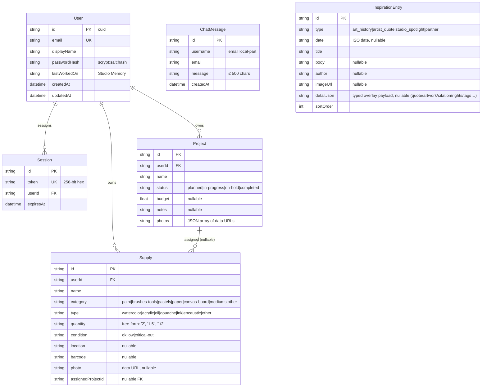

# AST Studio — Master Project Architecture Document (PAD) v1.0

**Classification:** Internal Engineering Reference
**Status:** DEFINITIVE, PRODUCTION-LOCKED BLUEPRINT
**Companion Document:** `README.md` (onboarding), `AGENTS.md` (agent instructions), `CLAUDE.md` (engineering standards)
**Last Updated:** 2026-09-16
**Audience:** Senior Engineers, Tech Leads, DevOps, and Onboarding Engineers
**Rule:** Every architectural decision in this document traces to a specific rationale.
Nothing is here "because it's popular."

#### Revision Block — v1.0 (Tracked Changes)

- `[SYN]` Initial PAD generated alongside the v1.0 codebase — every section
  verified against the actual source tree and executed commands on
  2026-09-16 (lint/typecheck green; golden paths browser-verified).

---

## Table of Contents

1. [System Overview & Decisions](#1-system-overview--decisions)
2. [High-Level System Topology](#2-high-level-system-topology)
3. [Application Architecture](#3-application-architecture)
4. [Data Architecture](#4-data-architecture)
5. [Design System Reference](#5-design-system-reference)
6. [Security Architecture](#6-security-architecture)
7. [Testing Strategy](#7-testing-strategy)
8. [Build & Deployment](#8-build--deployment)
9. [Developer Handbook](#9-developer-handbook)
10. [Known Issues & Outstanding Tasks](#10-known-issues--outstanding-tasks)
11. [Key Files Reference](#11-key-files-reference)
12. [Glossary](#12-glossary)

---

## 1. System Overview & Decisions

### 1.1 Document Metadata & Purpose

AST Studio is a full clone of the Art Supply Tracker artist beta
(`studiobeta.artsupplytracker.com`) — a studio assistant for artists with
projects, supplies, an inspiration feed, and community chat. The original is
a Vite React SPA backed by AWS Amplify (Cognito authentication, AppSync
GraphQL data). This codebase reproduces the product on a self-contained
Next.js stack. Use this PAD to understand why each seam exists, to extend the
app, or to replicate the architecture elsewhere.

### 1.2 Technology Stack Summary

| Layer | Technology | Version | Key Rationale |
|---|---|---|---|
| Web framework | Next.js (App Router) | 16.1.3 | RSC-first rendering with server-side session resolution; single-route contract satisfied by one `page.tsx` |
| UI runtime | React | 19.2.3 | Only runtime Next 16 supports without shims; RSC + client islands |
| Language | TypeScript | 5.9.3 (`strict`) | Type-safe end to end; DTO discipline enforced |
| Styling | Tailwind CSS + `@tailwindcss/postcss` | 4.1.18 | CSS-first `@theme` tokens reproduce the original palette exactly; no config file drift |
| UI primitives | shadcn/ui on Radix | scaffold set | Accessible dialogs/select primitives without hand-rolling ARIA |
| Database | SQLite | bundled file | Zero-config persistence; adequate for single-studio scale |
| ORM | Prisma | 6.19.2 | Typed queries + schema-as-migration workflow (`db:push`) |
| Validation | Zod | 4.3.5 | Single validation dialect at every action boundary |
| Package manager / runtime | Bun | ≥ 1.3 | Fast installs; runs the dev/prod scripts |
| Lint | ESLint (`next/core-web-vitals` + `next/typescript`) | 9.x | Flat config; scoped to app source via `ignores` |

### 1.3 Architecture Decision Records (ADRs)

**ADR-001: Single-route, client-switched views (not page routes)**

- **Context:** The original app is a React Router SPA with `/dashboard`,
  `/projects`, `/supplies`, `/inspiration` URLs. The deployment contract for
  this codebase exposes exactly one user-visible route.
- **Decision:** One Next.js route (`src/app/page.tsx`) renders either the
  login gate or the `StudioApp` shell; the four views switch via client
  state (`StudioView` union) inside the shell.
- **Rationale:** Satisfies the deployment contract while preserving the SPA
  behavior being cloned; server-side session check happens once per route
  load, and `router.refresh()` re-runs it after auth changes.
- **Consequences:** No per-view URLs (browser back does not move between
  views). Acceptable — matches the beta's behavior closely enough for a
  clone and keeps the auth boundary in one place.
- **Alternatives Rejected:** Four page routes (violates the single-route
  contract); `?view=` search-param routing (adds URL state that must be
  guarded without adding real value here).

**ADR-002: SQLite via Prisma (not PostgreSQL)**

- **Context:** The original persists through AppSync (DynamoDB-backed). A
  clone must run with zero cloud dependencies and minimal ops surface.
- **Decision:** Prisma with the SQLite provider; schema lives in
  `prisma/schema.prisma`; the database file is `db/custom.db` (gitignored).
- **Rationale:** Single-writer studio workloads (one artist, low write
  volume, community chat at demo scale) are comfortably inside SQLite's
  envelope; the schema-as-migration workflow (`bun run db:push`) removes an
  entire migration discipline from a clone that only needs reproducible
  structure. Swapping `provider` to `postgres` later is a schema-only change.
- **Consequences:** No DB CHECK constraints generated (validation is Zod at
  the boundary); no concurrent multi-process writes; no native enums.
- **Alternatives Rejected:** PostgreSQL + Docker (heavyweight for the
   target environment); in-memory/localStorage (loses persistence and
   shared chat).

**ADR-003: Custom scrypt + session-table auth (not NextAuth)**

- **Context:** The original uses AWS Cognito. The clone needs email +
  password sign-in/up/out only — no OAuth, no MFA.
- **Decision:** `src/lib/auth.ts` — scrypt password hashing (Node built-in,
  per-user random salt, `scrypt:salt:hash` storage format, timing-safe
  verification), opaque 256-bit session tokens in a `Session` table, set as
  an httpOnly `ast_session` cookie (30-day TTL, `sameSite=lax`).
- **Rationale:** Smallest correct surface for the requirement; sessions are
  server-revocable (a DB row), unlike stateless JWTs; no third-party crypto
  to vet. Uniform "incorrect email or password" errors prevent account
  probing.
- **Consequences:** No password reset flow (a documented notice points to
  support); no email verification (the original's spam-folder copy is
  preserved but no mail is sent).
- **Alternatives Rejected:** NextAuth v4 (available in the scaffold but
  brings an adapter + provider model unused by this flow); JWT sessions
  (unrevocable within TTL).

**ADR-004: Server Actions as the only mutation surface (no REST/GraphQL)**

- **Context:** The original talks to AppSync GraphQL from the client. The
  clone runs on the same origin with RSC.
- **Decision:** All reads-at-mutation-time and writes flow through Server
  Actions in `src/actions/*.ts`, each returning the `ActionResult<T>`
  discriminated union. The only route handler is the `/api` health probe.
- **Rationale:** Actions are POST-only, same-origin, and type-checked end to
  end — no client fetch layer to drift, no CSRF-style surface, and error
  semantics are enforced by the shared union type (adopted from the
  Scandi Haven commerce-engine pattern).
- **Consequences:** Chat polling calls an action every 5 s (fine at this
  scale); machine callers (webhooks/cron) have no API surface (none exist).
- **Alternatives Rejected:** REST route handlers (requires a client fetch
  layer + serialization drift); tRPC (adds a dependency for one route).

**ADR-005: Chat via 5-second polling (not WebSocket)**

- **Context:** The original's chat is effectively request/response over
  AppSync. The clone needs multi-user message visibility without
  infrastructure.
- **Decision:** `listChatMessages` action polled every 5 s from
  `StudioChat`, skipped when `document.visibilityState !== "visible"`;
  sends optimistically append via the action's returned DTO.
- **Rationale:** Zero infrastructure, matches the original's perceived
  latency class, and the visibility gate keeps background tabs quiet.
- **Consequences:** Up to 5 s staleness for incoming messages; each poll is
  one SQLite read of ≤ 100 rows (sub-millisecond).
- **Alternatives Rejected:** Socket.io mini-service (adds a second process
  + gateway wiring for a beta-scale wall); SSE (still a route handler +
  connection state).

**ADR-006: Photos as client-downscaled data URLs (not object storage)**

- **Context:** The original uploads photos to cloud storage. The clone has
  no storage service.
- **Decision:** The modal components decode the picked file with
  `createImageBitmap`, draw to a ≤ 1024 px canvas, encode JPEG q0.8, and
  reject results > 300 KB; the data URL is stored in the `photos` JSON
  array (`Project`) or `photo` column (`Supply`) and rendered with
  `next/image unoptimized`.
- **Rationale:** Keeps the feature fully functional offline with bounded
  row sizes; the encode-size cap is enforced client-side and re-checked as
  Zod length caps server-side.
- **Consequences:** SQLite rows grow with photos (bounded to ~10 × 300 KB
  per project); no dedup; `unoptimized` avoids the sharp pipeline for data
  URLs.
- **Alternatives Rejected:** Filesystem writes (ephemeral in most deploy
   targets); S3-compatible client uploads (cloud dependency).

**ADR-007: Tailwind v4 CSS-first token theme (no config file)**

- **Context:** The clone must reproduce the original's exact palette; the
  scaffold shipped a legacy v3-style `tailwind.config.ts`.
- **Decision:** All tokens live in one `@theme` block in
  `src/app/globals.css` as literal hex values (`--color-ast-*`, plus shadcn
  semantic tokens pinned to the dark palette). The legacy config file was
  deleted.
- **Rationale:** Tailwind v4 resolves `@theme` literals into utilities with
  working opacity modifiers (`border-ast-purple/35`); `var()` chains inside
  `@theme` are silently dropped by the build (verified in the Scandi Haven
  codebase), so literals are the only reliable form.
- **Consequences:** The app is permanently dark — theming would mean
  editing the token block. Acceptable: the product is a dark studio UI.
- **Alternatives Rejected:** Keeping `tailwind.config.ts` (dead config
   drifts from the real token source); `@theme inline` + `:root` switching
  (runtime theming the product doesn't need).

---

## 2. High-Level System Topology

```text
┌──────────────────────────── Browser ────────────────────────────┐
│  LoginScreen  │  StudioApp (client island)                      │
│               │  ├─ Sidebar / 4 views / modals / StudioChat     │
│               │  └─ Server Action calls (POST, same-origin)     │
└──────────────────────┬───────────────────────────────────────────┘
                       │ RSC payload / action RPC
┌──────────────────────▼───────────────────────────────────────────┐
│  Next.js 16 App Router — single route (src/app/page.tsx)         │
│  ├─ RSC render: session → (login | StudioApp + first-paint DTOs) │
│  ├─ src/actions/auth.ts      signIn / signUp / signOut           │
│  ├─ src/actions/studio.ts    projects / supplies / chat / import │
│  └─ src/app/api/route.ts     GET health probe (machine-only)     │
└──────────────────────┬───────────────────────────────────────────┘
                       │ Prisma Client
┌──────────────────────▼───────────────────────────────────────────┐
│  SQLite (db/custom.db) — 6 tables, file-based, gitignored        │
└──────────────────────────────────────────────────────────────────┘
```

- **Client layer:** one browser app; no CDN/edge tier in the reference
  deployment.
- **Application layer:** a single Node process (dev or standalone prod
  server); scaling is vertical — SQLite's single-writer envelope is the
  boundary (see §10).
- **Data layer:** one SQLite file, no cache, no external services.

---

## 3. Application Architecture

### 3.1 The Layer Model

```
Layer 0: src/lib (auth, db, result, validation, dto, studio-domain)
         Pure infrastructure + contracts. No imports from layers above.
Layer 1: src/actions (auth.ts, studio.ts)
         The only write surface. Imports Layer 0 only. Returns ActionResult<T>.
Layer 2: src/components/studio (client islands + views)
         Imports actions + DTO types + domain constants. Never imports Prisma
         or server-only modules directly.
Layer 3: src/app/page.tsx (RSC entry)
         Session resolution + first-paint queries → hands typed DTOs to Layer 2.
```

**Golden Rule:** dependencies point strictly downward
(`app → components → actions → lib`). A component importing
`@/lib/auth` (a `server-only` module) breaks the build — by design, that
boundary is the security seam.

### 3.2 Annotated Directory Structure

```
├── prisma/
│   └── schema.prisma          ← 6 models; schema IS the migration (db:push)
├── public/
│   ├── robots.txt             ← permissive bot policy
│   └── assets/                ← brand imagery cloned from production
├── scripts/
│   └── seed.ts                ← idempotent: demo user, chat history, 15 live entries
├── src/
│   ├── actions/
│   │   ├── auth.ts            ← signIn / signUp / signOut (ActionResult)
│   │   └── studio.ts          ← projects/supplies CRUD, chat, importStudioData
│   ├── app/
│   │   ├── api/route.ts       ← GET health probe (db SELECT 1)
│   │   ├── globals.css        ← @theme tokens + scrollbar + motion
│   │   ├── layout.tsx         ← Inter font, AST Studio metadata
│   │   └── page.tsx           ← THE route: session → LoginScreen | StudioApp
│   ├── components/
│   │   ├── studio/
│   │   │   ├── studio-app.tsx     ← shell: header, sidebar, views, community
│   │   │   ├── login-screen.tsx   ← auth gate (tabs, show-password)
│   │   │   ├── studio-sidebar.tsx← tools column + mobile drawer
│   │   │   ├── studio-chat.tsx    ← message wall + 5s polling
│   │   │   ├── dashboard-view.tsx ← Today in the Studio cards
│   │   │   ├── projects-view.tsx  ← status columns + needs sorting
│   │   │   ├── supplies-view.tsx  ← category grid + expandable lists
│   │   │   ├── inspiration-view.tsx ← feed tabs + quotes/spotlights/partners
│   │   │   ├── project-modal.tsx  ← create/edit (photos as data URLs)
│   │   │   └── supply-modal.tsx   ← create/edit (category/type/condition…)
│   │   └── ui/                ← shadcn/ui primitives
│   └── lib/
│       ├── auth.ts            ← scrypt + sessions (server-only)
│       ├── db.ts              ← Prisma client singleton
│       ├── result.ts          ← ActionResult<T> union + error factories
│       ├── validation.ts      ← Zod schemas (every action input)
│       ├── dto.ts             ← client-safe DTO types + ExportPayload
│       └── studio-domain.ts   ← status/category/type/condition vocabulary
├── docs/
│   ├── ssh_git_wrapper_v3.py  ← deploy-key push wrapper (main only)
│   └── how-to-git-push-using-ssh-wrapper_SKILL.md ← operator runbook
```

### 3.3 Critical Code Patterns

**Pattern 1 — the ActionResult action (the only mutation contract):**

```typescript
// src/actions/studio.ts (excerpt)
export async function createProject(
  input: unknown,                       // unknown at the boundary — never trust shapes
): Promise<ActionResult<ProjectDto>> {
  const user = await requireUser();     // session-derived identity
  if (!user) return unauthorized();

  const parsed = projectInputSchema.safeParse(input);   // Zod gate
  if (!parsed.success) {
    return validationError(parsed.error.issues[0]?.message ?? "Please check the project form.");
  }

  try {
    const row = await db.project.create({ data: { userId: user.id, ...parsed.data } });
    return { ok: true, data: toProjectDto(row) };       // DTO, never the row
  } catch (error) {
    console.error("[projects:create] failed", { userId: user.id, error });
    return internalError();             // safe copy; detail stays server-side
  }
}
```

*Why this pattern:* the union type forces every caller to handle failure;
the try/catch boundary guarantees nothing throws across the RPC edge; the
log carries operation + identity context for diagnosis while the client sees
a customer-safe message.

**Pattern 2 — session resolution in the RSC entry:**

```typescript
// src/app/page.tsx (excerpt)
export const dynamic = "force-dynamic";   // session-dependent — never cache

export default async function StudioPage() {
  const user = await getCurrentUser();    // awaits cookies() (Next 16)
  if (!user) return <LoginScreen />;
  const [projects, supplies, chat, inspiration] = await Promise.all([ /* … */ ]);
  return <StudioApp user={…} projects={…} supplies={…} chatMessages={…} inspiration={…} />;
}
```

*Why this pattern:* one authoritative session decision point; auth state
changes (sign-in/up/out) call `router.refresh()` to re-run exactly this
render path — there is no second source of auth truth in the client.

**Pattern 3 — vocabulary as a single module:**

```typescript
// src/lib/studio-domain.ts (excerpt)
export const SUPPLY_CATEGORIES = [
  { value: "paint", label: "Paint", typeCount: 6 },
  // …
] as const;

export const SUPPLY_CATEGORY_VALUES = SUPPLY_CATEGORIES.map((c) => c.value);
```

*Why this pattern:* SQLite has no enums; the Zod schemas derive their enums
from these arrays (`z.enum(SUPPLY_CATEGORY_VALUES as [string, ...string[]])`)
and the UI pickers render the same lists — one edit point, zero drift.

**Pattern 4 — visibility-gated polling:**

```typescript
// src/components/studio/studio-chat.tsx (excerpt)
useEffect(() => {
  const interval = setInterval(() => {
    if (document.visibilityState !== "visible") return;   // background tabs stay quiet
    startTransition(async () => {
      const result = await listChatMessages();
      if (result.ok) setMessages(result.data);            // poll failures are non-fatal
    });
  }, POLL_INTERVAL_MS);
  return () => clearInterval(interval);
}, []);
```

*Why this pattern:* cheap freshness without infrastructure; the interval
survives re-renders via empty deps; errors deliberately do not surface
(noisy-5s-banner > a brief staleness gap).

---

## 4. Data Architecture

### 4.1 Database Schema



### 4.2 Data Models

- `Project.photos` / `Supply.photo` are text columns holding JSON / data
  URLs — SQLite has no list primitive; parsing degrades to "no photos" on
  corrupt JSON rather than breaking the view.
- `InspirationEntry.detailJson` holds the typed overlay payload behind the
  inspiration detail panels (quote, artwork caption, citation, rights,
  tags, spotlight handle/link) — parsed by `parseInspirationDetail`
  (`src/lib/inspiration.ts`) with the same degrade-to-null contract.
- `User.lastWorkedOn` feeds the Studio Memory widget and the header
  popover ("You were working on Watercolor Botanicals.").
- `ChatMessage` is global (community wall), not per-user; writes require a
  session, reads are public to signed-in studios.
- `InspirationEntry` is global editorial content maintained via the seed.

### 4.3 Persistence Strategy

- Prisma client singleton in `src/lib/db.ts` (survives HMR via
  `globalThis`); no pooling (SQLite file access).
- Schema changes: edit `schema.prisma` → `bun run db:push` (dev applies
  directly); no migration journal — reproducibility comes from schema +
  idempotent seed.
- Import is a replace-restore: `db.$transaction` deletes the user's
  supplies+projects then re-creates them from the validated payload —
  never a merge (re-importing a file twice yields the same state).
- Session expiry is checked per request (`expiresAt > now`); expired rows
  linger until overwritten (harmless, bounded by TTL).

---

## 5. Design System Reference

### 5.1 Typographic System

- **Typeface:** Inter (latin subset, 300–700 weights) via `next/font`,
  exposed as `--font-inter` and mapped by `--font-sans`.
- **Scale:** `text-xs` (eyebrows, 10–11 px with `tracking-[0.25em]`–
  `[0.35em]` uppercase) → `text-sm` body → `text-lg`/`text-xl` card titles →
  `text-3xl` page headline.

### 5.2 Color Tokens (`src/app/globals.css` `@theme`)

| Token | Hex | Usage |
|---|---|---|
| `ast-turquoise` | `#2ec4b6` | Studio Tools, Need help?, stat accents |
| `ast-cyan` | `#00e6ff` | My Studio heading, links, focus |
| `ast-purple` | `#5a3a8e` | Card borders (25–40% opacity) |
| `ast-lavender` | `#b78bff` | Section eyebrows, sidebar widgets |
| `ast-pink` | `#ff4db8` | Community, primary CTAs |
| `ast-blue` | `#4a69d6` | Utility buttons, gradient end |
| `ast-electric-blue` | `#2e64ff` | Quote text, electric accents |
| `ast-coral` | `#ff7a7a` | Errors, critical condition |
| `ast-yellow` | `#ffd5a8` | Header hover accents |
| `ast-body` | `#fff4d6` | Body text (60–90% opacity) |
| `ast-muted` | `#dcc7ff` | Login marketing copy |
| `ast-faint` | `#9f7fd6` | Placeholders, timestamps |
| Canvas / cards / drawer | `#050009` / `#120724` / `#0B0018` | Fixed surfaces (literal classes) |

All values extracted verbatim from the production app's generated CSS bundle.

### 5.3 Component Primitives

- shadcn/ui (New York style) provides dialog, select, toast primitives in
  `src/components/ui/`; studio surfaces compose them with the AST palette.
- The two modals are hand-rolled dialogs (`role="dialog"`, `aria-modal`,
  Escape-to-close, initial focus, scrim-click close) to match the original's
  exact chrome.

### 5.4 Motion

- One keyframe: `studio-fade-in` (300 ms, `cubic-bezier(.22,1,.36,1)`) used
  as `.studio-fade` on view/root transitions; `prefers-reduced-motion`
  disables it. Drawer transitions are Tailwind's `transition-transform
  duration-300`. No other animation — the original is deliberately calm.

---

## 6. Security Architecture

### 6.1 Security Rules

| Rule | Enforcement |
|---|---|
| Passwords are never stored or logged in plaintext | `hashPassword` (scrypt, 16-byte salt) at write; logs redact email to `3 chars + ***` |
| Sessions are httpOnly, sameSite=lax, secure-in-prod cookies | `createSession` in `src/lib/auth.ts` |
| Every mutation authenticates server-side | `requireUser()` first line of each action; identity comes from the session row, never client input |
| All action input is untrusted | `unknown` parameter types + Zod `safeParse` before any Prisma call |
| No account probing | Uniform "Incorrect email or password." for unknown email and bad password |
| XSS-safe rendering | React text nodes only; no `dangerouslySetInnerHTML`; data-URL photos rendered via `next/image` |
| SQL injection impossible | Prisma parameterized queries exclusively; no raw SQL except the health probe's `SELECT 1` |
| Import validates structure + bounds | `importPayloadSchema` caps arrays (500/1000), string lengths, and vocabulary enums |
| Secrets never committed | `.gitignore` rejects `.env*` (except example), `db/`, `*.key`, `ssh-key.txt`; push wrapper shreds materialized keys |
| Timing-safe credential compare | `timingSafeEqual` on the derived scrypt buffer |

### 6.2 Security Utilities

- `src/lib/auth.ts` — `hashPassword`, `verifyPassword` (timing-safe),
  `createSession`, `destroySession`, `getCurrentUser`, `requireUser`.
- `docs/ssh_git_wrapper_v3.py` — deploy-key push: 0600 temp file outside the
  repo, `IdentitiesOnly`, auth pre-flight (`git ls-remote`), key shred +
  sidecar known_hosts cleanup, explicit exit codes (0 ok / 1 usage / 2 key /
  3 git / 4 push).

### 6.3 Authentication & Authorization

- **Model:** single role (studio owner); no admin surface. Sessions are
  opaque tokens (DB rows) — sign-out deletes the row (immediate revocation);
  expiry is enforced on every read.
- **Data scoping:** every Project/Supply query filters
  `where: { userId: user.id }`; IDs from clients are re-checked against the
  owning user before update/delete (`findFirst({ id, userId })`) — no
  IDOR path.
- **Chat:** writes require a session; the username is derived server-side
  from the session email (not client-supplied).

### 6.4 Threat Model

| Vector | Mitigation |
|---|---|
| Credential stuffing | Uniform auth errors; 8-char minimum; no rate limiting yet (see §10) |
| Session theft | httpOnly cookie (no JS access); `sameSite=lax` blocks cross-site POSTs from other origins |
| IDOR on project/supply ids | Ownership re-check on every mutation |
| Malicious import files | Zod schema (structure, enums, lengths, counts); replace-scoped to the attacker's own data |
| Oversized photo payloads | Client encode cap (300 KB) + Zod string-length caps server-side |
| Key leakage in CI/pushes | Wrapper materializes keys outside the tree and shreds them; `.gitignore` blocks key-shaped files |

---

## 7. Testing Strategy

### 7.1 Test Distribution

| Category | Count | Location | Framework |
|---|---|---|---|
| Static | — | `eslint .` / `tsc --noEmit` | ESLint 9 + TS 5.9 strict |
| Automated unit | 24 tests | `src/lib/studio-domain.test.ts`, `src/lib/inspiration.test.ts` | Vitest (node env, `@/` alias) |
| Manual golden paths | 9 flows | README "Testing & Quality" | Browser-executed |

### 7.2 Test Patterns

Unit tests follow the Scandi Haven Vitest pattern (`vitest.config.ts` with
the `@/` alias, node environment, `src/**/*.test.ts`). They pin:

- **Studio-domain vocabulary** — the per-category `SUPPLY_TYPE_LISTS`
  (Paint 6 / Brushes & Tools 7 / Pastels 4 / Paper 5 / Canvas & Board 5 /
  Mediums 6 / Other 0) extracted verbatim from the live app's sub-views, so
  the Zod enums, pickers, and navigation tiles cannot drift.
- **Inspiration detail domain** — `inspirationDetailSchema` acceptance
  (quote/spotlight shapes, tag caps), `parseInspirationDetail` degradation
  (null / corrupt JSON / non-object / schema-invalid → null), and
  `pickToday` boundary selection (most-recent-on-or-before, future
  fallback, empty feed).

The broader verification contract remains the golden-path checklist
(sign-in → project → supply → chat → export/import → breadcrumb sub-views →
inspiration detail panels → mobile drawer), executed in a browser. The
parity remediation was verified this way end-to-end against the live site
(output text compared per sub-view), plus a visual review against the
production screenshot.

### 7.3 Coverage Thresholds

None enforced yet. New domain logic in `src/lib` requires tests-first
(red → green); contributions extending the suite should pin: actions ≥ 90%
lines (they are the mutation surface), lib ≥ 95%.

### 7.4 Pre-PR / Pre-Deploy Checklist

- [ ] `bun run lint` — zero errors
- [ ] `bun run typecheck` — zero errors
- [ ] `bun run test` — zero failures
- [ ] Golden paths exercised in a browser
- [ ] New action inputs have Zod schemas
- [ ] `git status` clean of `.env`, `db/`, logs, keys

---

## 8. Build & Deployment

### 8.1 Production Build

```bash
bun run build     # next build → .next/standalone
bun run start     # bun .next/standalone/server.js
```

### 8.2 Environment Variables

| Variable | Required | Description | Default |
|---|---|---|---|
| `DATABASE_URL` | yes | SQLite file URL; relative paths resolve from `prisma/schema.prisma` | `file:../db/custom.db` |

No secrets exist at runtime (no mailer, no OAuth, no webhooks) — the
smallest env surface in the class of apps.

### 8.3 Docker Configuration

None. The app targets Node/Bun hosts directly; the standalone output is
self-contained.

### 8.4 CI/CD Pipeline

No CI is configured in this repo (nothing fabricates a badge). The push
gate is the operator contract: `lint` + `typecheck` green, then push via
`docs/ssh_git_wrapper_v3.py` (main only, deploy key, shredded after use) —
see `docs/how-to-git-push-using-ssh-wrapper_SKILL.md`.

---

## 9. Developer Handbook

### 9.1 Local Setup

```bash
bun install
cp .env.example .env
bun run db:push && bun run db:seed
bun run dev               # → http://localhost:3000
```

Demo account: `demo@artsupplytracker.com` / `StudioDemo2026!` (rotate before
public exposure).

### 9.2 Common Commands

| Command | Location | Purpose |
|---|---|---|
| `bun run dev` | root | Dev server :3000 |
| `bun run lint` / `typecheck` | root | Quality gates |
| `bun run db:push` / `db:seed` | root | Schema apply / demo data (idempotent) |
| `bun run build` / `start` | root | Standalone prod build / serve |
| `python3 docs/ssh_git_wrapper_v3.py --key-stdin` | root | Push main via deploy key |

### 9.3 Code Style Rules

- TypeScript strict; `unknown` + Zod at boundaries; DTOs only across the
  client seam.
- ESLint flat config scopes `ignores` to non-app trees (skills, examples);
  the app source must stay lint-clean — never disable rules to pass.
- Conventional Commits, atomic scope; main branch only.

### 9.4 Git Workflow

- Single `main` branch; feature branches are merged via PR when a team
  workflow applies.
- Pushes use the SSH wrapper with an external deploy key; the wrapper pushes
  `HEAD:refs/heads/main` and refuses to embed keys in the tree.

---

## 10. Known Issues & Outstanding Tasks

| Priority | Issue | Impact | Status |
|---|---|---|---|
| Medium | ~~No automated test framework~~ | Regressions rely on manual golden paths | **Resolved 2026-09-16** — Vitest suite added (24 tests: studio-domain vocabulary + inspiration detail parsing); extend into `src/actions` next |
| Medium | No auth rate limiting | Credential-stuffing surface on public deployments | Open — add per-IP backoff on `signInAction` before any public host |
| Low | View state not URL-addressable | Browser back doesn't switch studio views | Accepted (ADR-001 consequence) |
| Low | Chat avatar colors keyed to seeded usernames | New users get the default purple avatar | Accepted (matches original's initials behavior) |
| Low | SQLite single-writer | No multi-process horizontal scale | Accepted (ADR-002); swap to Postgres by changing `provider` + URL if ever needed |
| Info | Partner Spotlight / Inspire Me are placeholders | Visual parity with the original beta's placeholders | Intentional — content arrives with partner integrations |

---

## 11. Key Files Reference

| File | Lines (≈) | Purpose |
|---|---|---|
| `src/app/page.tsx` | ~125 | The route: session resolution + first-paint DTO assembly |
| `src/components/studio/studio-app.tsx` | ~390 | Shell: header, sidebar wiring, views, community panel, import/export |
| `src/components/studio/projects-view.tsx` | ~280 | Tiles + breadcrumb sub-views (Series/Groups/status/Needs Sorting filters) |
| `src/components/studio/supplies-view.tsx` | ~320 | Category tiles + "Art Supplies › Paint › Watercolor" type navigation |
| `src/components/studio/inspiration-view.tsx` | ~375 | Feed tabs, quote carousel, spotlight/history/partner detail panels |
| `src/actions/studio.ts` | ~445 | Projects/supplies CRUD, chat, import (the mutation surface) |
| `src/lib/auth.ts` | ~90 | scrypt + sessions (server-only) |
| `src/lib/inspiration.ts` | ~75 | InspirationDetail schema, defensive parser, pickToday |
| `src/lib/validation.ts` | ~115 | Every Zod schema |
| `src/lib/studio-domain.ts` | ~130 | Status/category/type/condition vocabulary + per-category type lists |
| `src/app/globals.css` | ~110 | `@theme` tokens, scrollbar, motion |
| `prisma/schema.prisma` | ~100 | 6 models |
| `scripts/seed.ts` | ~360 | Idempotent demo content (live 15-entry feed w/ detail payloads) |
| `docs/ssh_git_wrapper_v3.py` | ~185 | Deploy-key push wrapper |

---

## 12. Glossary

- **AST** — Art Supply Tracker (the product's brand prefix).
- **ActionResult<T>** — the discriminated union every action returns:
  `{ ok: true, data } | { ok: false, error: { code, message } }`.
- **DTO** — client-safe data transfer type from `src/lib/dto.ts` (never a
  Prisma row).
- **Golden paths** — the browser flows that constitute the verification
  contract (auth, project, supply, chat, export/import, breadcrumb
  sub-views, inspiration detail panels, mobile drawer).
- **Studio Memory** — the "You were working on …" hint backed by
  `User.lastWorkedOn`.
- **Needs Sorting** — projects bucket for unrecognized statuses.
- **Deploy key** — SSH key with push rights to this repo only; supplied
  externally to the push wrapper, never stored in the tree.
