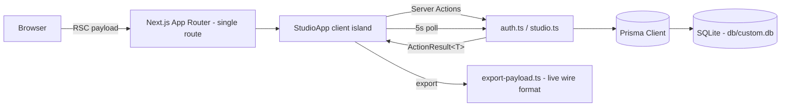

# AST Studio — Art Supply Tracker


A studio assistant built by an artist, for artists — a full clone of the
[Art Supply Tracker](https://studiobeta.artsupplytracker.com/dashboard/) artist beta,
rebuilt as a single Next.js application. Track supplies, projects, notes, and
creative workflows so you can spend less time searching and more time creating.

## Overview

Artists lose studio time hunting for supplies, remembering what a project
needed, and re-finding inspiration. AST Studio solves this with three
workspaces — **Projects**, **Supplies**, and **Inspiration** — wrapped in a
community chat panel, all on one dark, neon-accented dashboard. The original
production app is a Vite SPA on AWS Amplify (Cognito auth, AppSync GraphQL);
this clone reproduces its UI and behavior on a self-contained Next.js 16 stack
(Prisma + SQLite, Server Actions, session-cookie auth) so it runs anywhere
Node runs, with zero cloud dependencies.

## Key Features

| Feature | What it does |
|---|---|
| 🔐 Auth gate | Sign In / Create Account tabs, show-password toggles, the live's full Amplify error chrome — server errors (bad credentials, duplicate email, invalid code) in the pale-pink dismissible alert box, client validation inline (the Cognito password-policy rule stack + "Your passwords must match"), native browser validation — scrypt-hashed passwords, httpOnly opaque session cookies, per-IP sign-in rate limiting (5 attempts / minute), and the live's complete Reset Password flow (email view → Code/New Password confirmation view with the live's invalid-code rejection; no mailer exists, so no code can ever be valid — the honest simulation of the deployed behavior) |
| 🏠 Dashboard | "Today in the Studio" — Partner Spotlight, Art History, Artist Quote, Studio Spotlight cards; the Studio Spotlight card navigates to the inspiration Feed (the live's hardcoded section opens no panel); the header's ✧ memory button is inert, exactly like the live app |
| 🎨 Projects | Status columns (Planned / In Progress / On Hold / Completed), Needs Sorting bucket, create/edit modal with budget, notes, and photo attachments |
| 🗂️ Project detail panels | Click a project chip → detail panel with NEW badge, status pill, image well, budget, supply assignment ("Pick supply…" + Assign / × remove), Delete (with confirm), Edit Project — which swaps the panel for the live app's INLINE edit form in the same slot (single column, Planned-first status order, budget defaulting to 0). The sidebar's Recent Projects tiles focus a project the way the live app does: the "All Projects" list opens with that project's panel, and the focus is sticky — every later projects-view entry re-opens it (the live's focusRequest semantics) |
| 🖌️ Supplies | Category grid (Paint, Brushes & Tools, Pastels, Paper, Canvas & Board, Mediums, Other) with per-category counts, low-stock "!" indicators, condition tracking, barcode + location fields, project assignment |
| 🏷️ Per-category subcategories | The supply modal's Subcategory picker follows the category (Paint → Watercolor…, Brushes & Tools → Palette knives…, hidden for Other) with an "Other / Custom…" free-form input — exactly the live app's option lists and custom flow |
| 📋 Supply detail panels | Click a supply chip → detail panel (Category / Subcategory / Quantity / Location) with Delete (with confirm) and Edit Supply — which swaps the panel for the live app's INLINE edit form (pink chrome, Notes as a single-line input, distinct edit placeholders like "e.g., 2 or 1/2" / "e.g., 012345678901", "Add to Project" with the current-assignment chip) |
| 🔍 Stock filters | "All | Low Stock | Out of Stock" tabs on every supply list — Low Stock matches low AND critical, Out of Stock critical only (the live bundle's filter switch) — with the live app's "No supplies match this filter." empty state |
| ✨ Inspiration | Today / Art History / Inspire Me feed tabs, artist quotes, studio spotlights, partner placeholders (15 seeded entries); the sidebar's TODAY IN ART HISTORY and PARTNERS rail buttons auto-expand their detail panels on the Feed (the live's location-state sections), while QUOTE OF THE DAY and STUDIO SPOTLIGHT navigate without a panel — the live's inert sections, pinned by tests |
| 💬 Studio Chat | Community message wall with 5-second polling that pauses on hidden tabs |
| 📦 Import / Export | Round-trip JSON backup in the ORIGINAL app's wire format (`title`, `subcategory`, `quantityValue`/`qty`, `supplyIds`, `isNew`, unset `budget`/`barcode` as `""` — the live app's in-memory defaults) — live-app exports import here and vice versa; the legacy clone format imports too |
| 📱 Responsive | Desktop: three glass cards (sidebar / main / chat) in a 12-column grid, each rounded-3xl on the blurred `#0B0018` canvas with per-panel accent borders and internal scrolling; mobile: slide-in drawers with the "☰ Studio Tools" / "Chat ☰" toggle bar |

## Architecture

| Layer | Technology | Version | Purpose |
|---|---|---|---|
| Web framework | Next.js (App Router) | 16.1.3 | Single-route server-rendered shell |
| UI runtime | React | 19.2.3 | RSC-first with client islands |
| Language | TypeScript (strict) | 5.9.3 | Type-safe end to end |
| Styling | Tailwind CSS (CSS-first `@theme`) | 4.1.18 | AST design tokens as theme variables |
| UI primitives | shadcn/ui + Radix | bundled | Dialogs, selects, toasts |
| Database | SQLite via Prisma ORM | 6.19.2 | Zero-config persistence |
| Validation | Zod | 4.3.5 | Every action boundary |
| Runtime | Bun | ≥ 1.3 | Package manager + scripts |



Mutations flow exclusively through **Server Actions** returning
`ActionResult<T>` unions — there are no REST endpoints for UI operations (the
lone route handler is a `/api` health probe). Export/import payloads are
built and normalized in `src/lib/export-payload.ts`, which emits and accepts
the original app's exact JSON shape.

## File Hierarchy

```
📂 prisma/            schema.prisma — 6 models (User, Session, Project, Supply, ChatMessage, InspirationEntry)
📂 public/assets/     Brand images (logo, portraits, artworks, ADC badge)
📂 scripts/           seed.ts — idempotent demo/bootstrap data
📂 src/
  📂 actions/         Server Actions: auth.ts (rate-limited sign-in), studio.ts (projects/supplies/chat/assignment/import)
  📂 app/             page.tsx (session-aware shell), layout.tsx, globals.css (@theme tokens)
  📂 components/
    📂 studio/        Login, shell, sidebar, 4 views, chat, 2 modals, 2 detail panels
    📂 ui/            shadcn/ui component set
  📂 lib/             db, auth (scrypt + sessions), result (ActionResult), validation (Zod), dto, studio-domain, inspiration, export-payload, rate-limit
📂 docs/              SSH push wrapper + operator runbook, reference prompts,
                      session logs, screenshots/ (dev-server visual reference)
📂 .github/           verify-gate workflow (lint + typecheck + test + build on every push)
```

## Quick Start

Requires Node.js ≥ 20 (or Bun ≥ 1.3).

```bash
bun install                 # or: npm install
cp .env.example .env        # DATABASE_URL for SQLite
bun run db:push             # create the schema in ./db/custom.db
bun run db:seed             # demo account + community content (idempotent)
bun run dev                 # http://localhost:3000
```

**Verify setup:** the login screen renders with "Join the Art Supply Tracker
Artist Beta". Sign in with the demo account below — the dashboard shows
`PROJECTS 0 · SUPPLIES 0 · INSPO 15 entries` and the Studio Chat history.

### Demo Account

| Field | Value |
|---|---|
| Email | `demo@artsupplytracker.com` |
| Password | `StudioDemo2026!` |

The demo account ships with an empty studio (matching the original beta's
fresh state) and the seeded community content. Create your own account via
the **Create Account** tab — registration is fully functional. This is a
documented demo credential, not a real secret; change it or delete the user
before exposing any public deployment.

## Environment Variables

| Variable | Required | Description | Default |
|---|---|---|---|
| `DATABASE_URL` | yes | SQLite file URL — relative paths resolve from `prisma/schema.prisma` | `file:../db/custom.db` |

## Testing & Quality

```bash
bun run lint        # ESLint (next/core-web-vitals + next/typescript)
bun run typecheck   # tsc --noEmit (strict)
bun run test        # Vitest — domain vocabulary, bundle-pinned style maps, validation (incl. the normalized import gate), export/import wire format, rate limiting, action layer (temp SQLite)
bun run test:e2e    # Playwright — golden paths against the running app (see below)
bun run dev         # then exercise the flows below (or run the smoke suite)
```

`bun run test:e2e` (Playwright, 25 specs) drives the golden paths
against a real browser: the auth gate (Amplify chrome, bad-credential
alert, sign-in/sign-out round-trip), the dashboard surface (stat tiles,
the four cards, the seeded chat history, the send-button contract),
project + supply CRUD through the real UI (create modals, chip → detail
panels, inline edit, native-confirm deletes, the recent-projects
sticky-focus flow, away-and-back navigation), the import/export surface
(export downloads the original app's JSON envelope), and the mobile
navigation menu at the live's viewport — drawer geometry (312px, slide,
inert on closed drawers), the shared scrim, drawer navigation, and the
Chat toggle. It signs in ONCE per run (a setup project saves the session
cookie — the sign-in rate limiter is a pinned contract) and cleans up
every row it creates through the real UI. Prerequisites: `bun run
db:push && bun run db:seed`; the config boots its own dev server (or set
`E2E_BASE_URL` to target a running one).

`python3 scripts/smoke_functional.py` drives the golden paths in a real
browser (via the `agent-browser` CLI): sign-in, supply create → list,
away-and-back → category grid, stock filters, chip detail panels,
native-confirm deletes, project CRUD, the Recent Projects focus flow
(rail click → list + panel, sticky across away-and-back — the live
app's focusRequest semantics), the inspiration rail panels, and the
import/export surface — leaving the studio pristine. It doubles as the
regression suite for the post-create navigation contract.

Automated tests (Vitest, 310 tests) pin the studio-domain vocabulary
(per-category supply subcategory lists in the live app's tokens), the
production bundle's status/condition style maps (project status pills,
chip borders with per-status hover/selected treatments, supply condition
pills incl. the two-state absent-vs-explicit "?"/"OK" rendering, the
detail-panel condition icon ternary incl. the "✓ ok" branch, and the
stock-filter switch where Low Stock matches low AND critical), the
design-token literals (the live bundle's compiled utility ground truth,
plus the r15 keyboard/focus-contract pins — no authored outline color, so
the UA-default focus ring renders like the live's, and the create modals
carry no Escape-close or focus steal, matching the live's no-affordance
keyboard behavior),
the Zod boundary contracts (photo data-URL caps, the Other/Custom
free-form subcategory flow, the normalized import gate, the Cognito
password-policy rules, the permissive sign-in schema, and the live's
quantity format gate with its exact error copy), the export/import wire
format (live-app shape with `title`/`subcategory`/`supplyIds`/numeric
quantities — incl. the empty-qty `qty:""` slot, the fraction
`quantity:null` slot, and the absent-vs-explicit status emission — plus
the legacy clone shape and the empty-qty/explicit-ok import round-trip),
the sign-in rate limiter, the inspiration rail section resolver
("art-history-today" / "partner" expand their panels; "quote"
and the hardcoded "spotlight-kevin-lewis" are the live's inert
sections), the seeded community-chat fidelity (the live history's five
messages pinned byte-for-byte — the live author's own typos, "KIm" and
"brower", included and guarded against silent "correction"), the login +
header + chat panel fidelity (file-content pins on the live's measured
Amplify geometry: the responsive logo's intrinsic 1068×269 aspect, the
Tailwind-v3 radius scale, the zero-webfont InterVariable stack, the sticky
community header + scroll-container split, the eye-toggle's
input-segment chrome and near-invisible #0d1a26 icons, the invisible-typing
input quirk, the tab strip's 2px gray/turquoise top border, the
pale-pink dismissible Amplify alert box with its exact warning/X icon
paths, the Cognito policy-rule stack, the Reset Password confirmation
view, the content-width 35px link buttons, and the native-validation
attribute set), the drawer-scrim fidelity, the supply-surface fidelity
(the create modal's inert Stock Status select, the quantity format
gate's exact copy, the edit panel's `?? "ok"` condition init, the
chip's unconditional qty label, and the detail panel's raw quantity
rendering), the sidebar stat-tile fidelity (the ACTIVE view's tile
carries its own accent pair — electric blue for Projects/Supplies,
lavender for Inspo), the header button fidelity (the memory button's
hyphen-family literal colors — idle border `#5b3fd3`, hover trio
`#f4f27a` — and the `@custom-variant hover (&:hover);` override that
restores the live's Tailwind-v3 plain-`:hover` semantics, so the
clone's hover tints engage on tap exactly like the live app's), the
motion-contract fidelity (r17: the live renders every studio surface
instantly — no authored `@keyframes`, no `.studio-fade` entry animation,
no `prefers-reduced-motion` guard; the drawers' `transition-transform
duration-300` slide stays as the live's only studio motion), the
landmark & reading-order fidelity (r18: the announcement order —
header → sidebar → content → chat — verified identical on both sides at
both viewports; the closed drawers' `inert` + `aria-hidden` pair is the
kept r5 improvement — the live's closed drawers carry neither — with
labeled drawer landmarks; the content pane is a single `<section>` under
one `<main>`, where the live nests an inner `<main>` and renders twin
md-toggled content copies), and
the full action surface
against a throwaway SQLite database (CRUD, ownership/IDOR checks,
assignment, import — including the mid-import failure that must roll back
without emptying the studio and the mid-delete failure that must not
strand supplies).

Manual verification checklist (the golden paths):
1. Sign in / create an account / sign out (6 rapid bad logins → throttled).
2. Create a project → sidebar stats update immediately ("active" counts
   In Progress only, matching the live app).
3. Add a supply (per-category subcategory picker) → the view switches to
   the supply list with "All | Low Stock | Out of Stock" tabs; category
   tiles show the "!" indicator for low/critical stock. Navigating away
   and back returns to the category grid (only the immediate post-create
   transition shows the flat list — the live app's behavior).
4. Click a supply chip → detail panel; Delete with confirm; Edit Supply.
5. Click a project chip → detail panel; assign supplies ("Pick supply…" →
   Assign / × remove); Delete with confirm; Edit Project.
6. Send a chat message → it appears and survives reload.
7. Export Data → downloads the original app's JSON shape; Import that file
   (or a live-app export) → "Import successful" and data restored with
   project↔supply assignments intact.
8. Projects tiles → breadcrumb sub-views (Series / Groups / status filters /
   Needs Sorting) with back navigation and singular/plural counts.
9. Supplies tiles → "Art Supplies › Paint" type tiles → type-filtered list.
10. Inspiration → quote carousel, spotlight / art-history / partner detail
    panels with artwork, citations, rights, and tags.
11. Mobile viewport: sidebar drawer opens/closes; "Chat ☰" toggles the
    community panel.

## Design System

| Token | Hex | Usage |
|---|---|---|
| `ast-turquoise` | `#2ec4b6` | Studio Tools label, projects chrome, Need help? card |
| `ast-cyan` | `#00e6ff` | My Studio heading, links, selected chip names |
| `ast-lavender` | `#b78bff` | Section eyebrows, muted headings, field labels, active Inspo tile |
| `ast-pink` | `#ff4db8` | Supplies chrome, community accents, primary CTAs |
| `ast-purple` | `#5a3a8e` | Card borders (25–40% opacity) — the live *utility* value (its `:root` `#5b3fd3` is resolved only by the hyphen-family utilities on the header memory button, reproduced there as a literal) |
| `ast-blue` | `#4a69d6` | Utility buttons, quote text |
| `ast-electric-blue` | `#2e64ff` | Planned status, active Projects/Supplies tiles, quote text |
| `ast-coral` | `#ff7a7a` | Needs Sorting bucket, unknown-status fallback (the live *utility* value; `:root` `#ffe0cc` is vestigial) |
| `ast-yellow` | `#ffd5a8` | On Hold status, low-condition icon, Close/Cancel/Delete buttons (the live *utility* value; the memory button's hover trio uses the hyphen-family `#f4f27a`, reproduced as literals) |
| `ast-orange` | `#ffb85c` | Warm accents |
| `ast-body` | `#fff4d6` | Body text (at 60–90% opacity) |
| `ast-faint` | `#9f7fd6` | Placeholders, timestamps |
| `ast-muted` | `#dcc7ff` | Secondary text |
| `ast-deep` / `ast-bg-dark` | `#0f1230` / `#14182b` | Panel wells, field surfaces |
| `ast-bg-primary` / `ast-bg-secondary` | `#121a5a` / `#1822a8` | Legacy canvas accents |
| Canvas / cards / drawer | `#050009` / `#120724` / `#0B0018` | Fixed surfaces (literal classes) |
| TW default `pink-200/300/400/500` | `#fbcfe8` / `#f9a8d4` / `#f472b6` / `#ec4899` | Sign Out button, memory-button text, chat error alert — the live's Tailwind-v3 default values, pinned in `@theme` (r14; TW4's re-derived palette drifts up to 34/channel) |
| TW default `cyan-400` / `blue-400/500` | `#22d3ee` / `#60a5fa` / `#3b82f6` | Email gradient stops, barcode focus chrome — the live's v3 values, pinned in `@theme` (r14) |
| Focus outline (keyboard) | UA default (`rgb(16,16,16)` in Chromium) | Every button/tile/link — the live authors NO outline color anywhere, so the browser default ring renders (r15; the shadcn scaffold's `outline-ring/50` was removed — it drew a turquoise ring the live never shows) |

Panel glow shadows (`shadow-ast-pink` / `-turquoise` / `-blue` / `-cyan` /
`-lavender` / `-warm`) reproduce the production bundle's 28px radial
blobs; two themed scrollbar rails (turquoise→blue for left panels,
pink→purple for right) ship as `.scrollbar-left` / `.scrollbar-right`.

**Typography:** ZERO webfonts ship (r8) — the live app's
`document.fonts` is empty and its `InterVariable, "Inter var", Inter,
-apple-system, …` stack resolves to system fonts on every machine, so the
clone's `--font-sans` mirrors that exact stack verbatim in an
`@theme inline` block. Do NOT re-introduce `next/font`: its self-hosted
Inter build has wider advance widths than the live's resolution and
visibly re-wraps text (pinned by `design-tokens.test.ts`).
Headline gradient: `linear-gradient(90deg, #00E6FF, #2E64FF, #8D5CFF,
#FF2FB3)`.

## Project Status

| Phase | Status | Key Deliverables |
|---|---|---|
| Clone build | ✅ Complete | Login, dashboard, projects, supplies, inspiration, chat, import/export |
| Parity remediation (r1) | ✅ Complete | Breadcrumb sub-views (projects/supplies), quote carousel + detail panels, live 15-entry seed with citations/rights/tags, modal label parity, Vitest suite |
| Parity remediation (r2) | ✅ Complete | Live data vocabulary (Paint/Brush/… categories, ok/low/critical conditions, per-category subcategories), supply + project detail panels with Delete, "All/Low Stock/Out of Stock" filters, supply assignment from the project panel, byte-compatible export/import with the original app's wire format, photo validation fix, active-stat fix, mobile "Chat ☰" toggle, sign-in rate limiting, action-layer tests, CI verify-gate workflow |
| Visual parity (r3) | ✅ Complete | Glass-card 12-column shell with per-panel accent borders, corrected brand tokens (purple/yellow/coral/orange + bg + glow shadows), per-view chrome (turquoise projects, pink supplies), bundle-pinned status pill/chip/condition style maps, rows-of-3 chip grids with in-row detail panels, gradient quote tiles, plain-purple chat avatars, native-alert import feedback, Inter via `@theme inline`, themed scrollbar rails (97 tests) |
| Parity remediation (r4) | ✅ Complete | Corrected brand tokens to the live *utility* values (purple #5a3a8e, yellow #ffd5a8, coral #ff7a7a — pinned by a new design-tokens test), inline Edit Project/Edit Supply panels replacing edit modals, Amplify-chrome login restyle (sharp #5B3FD3-bordered card, text tabs, 4px inputs, #FE5FA7 button, eye-icon switch), Other/Custom free-form subcategory flow, live unassigned-option copy, unset budget/barcode exported as "", chat-input and ✧-button accessible-name parity (109 tests) |
| Robustness remediation (r5) | ✅ Complete | Post-create supplies navigation parity (away-and-back → category grid; re-click keeps the sub-view), import hardening — `normalizedImportPayloadSchema` enforcement (array caps, string lengths, vocabulary enums) and single-transaction atomicity (a failed restore never empties the studio), "All <Category>" breadcrumb + empty-state parity (tabs hidden on empty lists, no create button in the filtered-empty state), `inert` on closed drawers, one chat poller per viewport, `pickToday` dedupe, import-alert refresh fallback, committed `scripts/smoke_functional.py` |
| Focus-flow parity (r6) | ✅ Complete | Recent Projects rail focuses a project like the live app ("All Projects" list + detail panel, sticky across away-and-back — the live focusRequest semantics, bundle-extracted and DOM-verified), the sidebar's TODAY IN ART HISTORY / PARTNERS rail buttons auto-expand their Feed panels (`resolveInspirationFocus` with the live's inert "quote" / "spotlight-kevin-lewis" quirks pinned by tests), the dashboard Studio Spotlight card navigates to the Feed; live account restored to the reference pristine state (131 tests, 23 smoke checks) |
| Seed-fidelity pass (r7) | ✅ Complete | Fresh full-surface recon (four-view + mobile VLM comparison of live vs clone — parity; all 15 inspiration entries, chat timestamps, and detail-panel content byte-verified against the live DOM; 23/23 smoke + all gates green) found one residual gap: the seeded chat history had silently "corrected" the live author's two typos. The seed now mirrors the live messages byte-for-byte ("KIm", "brower" — pinned by the new seed-fidelity test so they cannot drift again), local demo DB re-seeded and browser-verified (134 tests, 23 smoke checks) |
| Pixel-parity pass (r8) | ✅ Complete | Post-hydration DOM recon (the live renders different pre-hydration markup — steady-state measurements are the only ground truth) closed the last visual gaps: responsive header logo (intrinsic 1068×269 aspect, h-10/12/14 classes — header 88px desktop / 126px mobile, logo 222×56 / 159×40), Tailwind-v3 radius scale (rounded-lg/xl = 8/12px, not the scaffold's 16/20px — card histograms identical), zero-webfont font parity (the live ships no webfont; its InterVariable stack resolves to system fonts — the clone's self-hosted Inter had wider metrics that re-wrapped the Studio Memory text), the chat panel's sticky-header + scroll-container split (community rows at the live's exact coordinates), login Amplify chrome fidelity (equal-width tabs with the 2px gray/turquoise top strip, the eye toggle as the input's right segment with near-invisible #0d1a26 icons, #89949f borders, #9ca3af placeholders, the invisible-typing #0d1a26 input quirk, mobile h1 leading 1.25, Confirm-Password signup, Reset Password view, Amplify error copy), mobile chat drawer scrollbar parity, chat auto-scroll removal (the live has none) — 180 tests, 23 smoke checks, VLM parity on all views + login at both viewports |
| Error-state pass (r9) | ✅ Complete | Fresh full-surface recon (17 VLM comparisons + DOM spot-checks all PARITY — desktop/mobile views, sidebar drawer, login at both viewports) then an error-state deep-dive closed the auth-error chrome: server errors render in the live's Amplify alert box (bg #FCE9E9, 24px warning icon, 50×34 "Dismiss alert" button — byte-identical at (527,702) 414×58, wrapping to 72px, mobile (49,778) 292×72); the signup Cognito password-policy stack (every violated rule as its own contiguous 24px line — "Password must have at least 8 characters" / upper / lower / numbers / special — coexisting with the "Your passwords must match" line, both stacks DOM-identical incl. the card re-centering shift); the duplicate-email copy ("User already exists"); the complete Reset Password confirmation flow (Send code → Code * / New Password / Confirm / Submit / Resend Code view — card 480×485 with every element at the live's coordinates; Submit answers with the live's "Invalid verification code provided, please try again." — no mailer exists so no code can ever be valid, the honest simulation; Resend is a silent no-op); native form validation (no suppressed validation; password inputs required-only like the live); content-width 35px link buttons (Forgot 182px, Back to Sign In 127px, Resend Code 115px — the r8 51px forgot pin was a pre-hydration artifact). 202 tests, 23 smoke checks, all gates green |
| Drawer-scrim pass (r10) | ✅ Complete | Fresh recon on the r9 tree (9 VLM comparisons + DOM spot-checks + a live export-payload capture — all steady-state surfaces at parity; desktop chat structure, memory popover, and login card byte-identical) surfaced one residual chrome gap: the mobile drawer scrim. The live renders ONE shared scrim (`fixed inset-0 z-40 bg-black/60 md:hidden` — plain dim, NO backdrop blur, below the z-50 drawers, instant mount/unmount measured at click-time while the drawer still animates); the clone blurred the page behind the scrim (backdrop-blur-sm), floated it at z-50, and faded the sidebar's scrim. Fixed in `studio-app.tsx` + `studio-sidebar.tsx` and pinned by the new `drawer-fidelity.test.ts` (7 pins). Also re-confirmed as accepted: the mobile login card's 0.5px fractional offset (live 357px centered in its 358px column — Amplify internal responsive layout) and the live chat's prior-agent residue message. 209 tests, 23 smoke checks, all gates green |
| Supply-contract pass (r11) | ✅ Complete | A deep functional dive against the live (create/edit/export/import probes, every probe supply deleted, live left pristine) closed two HIGH-severity gaps in the supply contracts. QUANTITY: the live accepts an EMPTY quantity (stores "", chip renders the bare "qty" label, detail panel blank, export `qty:""` / `quantity:null` / `quantityValue:null`), validates the FORMAT (unparseable text is rejected with the exact copy "Enter a valid quantity, like 2, 1.5, or 1/2"), and its fraction exports carry `quantity:null` (plain-Number parse only) — the clone now mirrors all of it (`isValidQuantityInput`, wire-format fixes, import round-trips "" verbatim). CONDITION: the live's create-modal Stock Status select is INERT (created supplies carry no status, whatever the select showed — verified by creating one with "Low" selected), an ABSENT status renders the "?" pill + unlabeled "⚠️" detail glyph + status omitted in export, while an EXPLICIT "ok" saved through the edit panel renders the cyan "OK" pill + "✓ ok" icon + `status:"ok"` in export — the schema now models the two states (`condition String?`, null = absent; the modal submits null, the edit panel saves explicit values; import preserves the distinction). Also: `deleteProject` became atomic (detach + delete in one transaction), the README's stale `next/font` Typography paragraph was corrected to the zero-webfont contract, and the r10 accepted divergences were re-confirmed (nav-vs-aside drawer tag documented; the dev-mode Next.js badge + Geist font faces verified absent in the production build). Pinned by 20 new/adjusted tests incl. the new `supply-fidelity.test.ts` (6 source pins). 229 tests, 23 smoke checks, all gates green |
| Stat-tile accent pass (r12) | ✅ Complete | A fresh recon (8 paired screenshot comparisons + a pixel-level structural diff + DOM computed-style probes on both viewports) found ONE real divergence: the sidebar's ACTIVE stat tile. The live highlights the active view's tile with that tile's OWN accent pair — electric blue (`border/bg` at `/60`–`/10`) for Projects and Supplies, but LAVENDER for Inspo — while the clone hardcoded electric blue for all three (the Inspiration view visibly highlighted its tile in the wrong color). The active tile also drops the `#120724` card background and hover classes, and its inner text classes stay constant across states; the contract is identical in the desktop sidebar and the mobile drawer (geometry byte-identical: 106×78 @ (257,173)). `StatCard` now takes a per-tile `activeClass` prop, pinned by the new `sidebar-tile-fidelity.test.ts` (9 source pins). All other recon flags were traced to stale-capture timing artifacts, session-state residue, or the documented accepted deltas; the export wire format re-confirmed byte-identical. Post-fix evidence: the stat-tile regions diff at 0.00% hot pixels on both the desktop inspiration view and the mobile drawer; remaining diffs classified as the documented accepted set (live's residue chat message, dev-mode-only badge, sub-perceptual oklab-vs-rgba compositing + fractional text-row rounding). 238 tests, all gates green |
| Hover & hyphen-family pass (r13) | ✅ Complete | A fresh full-surface recon (8 paired VLM comparisons + pixel diffs — all PARITY; export byte-identical; sign-out flow probed; 23/23 smoke) surfaced two real divergences via a memory-popover probe. r13-F1: the live carries TWO parallel Tailwind color families — the underscored utilities (which our tokens pin) used by every other surface, and HYPHENATED families (`ast-purple`/`ast-yellow`) that exist ONLY on the header memory button and resolve the live's `:root` values (idle border `#5b3fd3/30`; hover border/bg/text `#f4f27a` at `/70`/`/20`/solid) — the clone's verbatim class copy had resolved them to the utility values (#5a3a8e/#ffd5a8), rendering the wrong idle border and all three hover colors; now literal arbitrary values with the emitted fallback rules byte-identical to the live's (canvas-verified identical pixels). r13-F2: Tailwind v4 media-guards `hover:` utilities (`@media (hover: hover)`) while the live's TW3 compiles plain `:hover` — on touch the live's tints stick on tap while the clone's never engaged; `@custom-variant hover (&:hover);` restores the live's semantics (and makes hover parity verifiable in captures — the paired popover shot shows both buttons hovered in `#f4f27a/20`, popover region 0.00% hot). The disproven "dead :root values" comments corrected; 8 fresh dev-server screenshots added under `docs/screenshots/`. Both fixes pinned by the new `header-button-fidelity.test.ts` (9 pins). 247 tests, all gates green, production build + server probe verified |
| Default-palette pin pass (r14) | ✅ Complete | A fresh full-surface recon (8 paired VLM comparisons + pixel diffs at the identical r13 values — every cluster in the documented accepted set; export byte-identical; 23/23 smoke; the r12/r13 fixes re-verified intact) plus a NEW probe dimension: a systematic DOM-level hover-contract sweep across both sessions — the probe class that found r13-F1, extended to every interactive element. The sweep surfaced one real divergence: seven surfaces use Tailwind DEFAULT palette classes (the Sign Out button's `border-pink-400/60` + `text-pink-200` + `hover:bg-pink-500/20`, the memory button's `text-pink-300`, the email gradient's `from-cyan-400 via-blue-500 to-pink-500`, the barcode fields' blue focus trio, the chat error alert's `text-pink-300`), and Tailwind v4 re-derived its default palette in oklch — those classes resolved values drifting from the live's Tailwind v3 palette (pink-400 #fb64b6 vs #f472b6, cyan-400 #00d2ef vs #22d3ee — up to 34/channel; sub-threshold in screenshot diffs, the same "invisible in captures" class as r13-F1's hovers). Fixed by pinning the seven default-family tokens to the live's v3 values in `@theme` (spike-verified: a user override replaces TW4's default emission entirely; the baked fallback rules become byte-identical to the live's — `.border-pink-400\/60` → `#f472b699`), with the usage sites keeping the live's class strings verbatim. Verified at CSS, computed-style, and rendered-pixel levels (canvas readback maxd=0); 13 new design-tokens tests (7 token pins + TW4-drift negative + 5 usage-site pins). 260 tests, all gates green, production build verified, `docs/screenshots/` re-shot on the remediated tree |
| Focus & keyboard-contract pass (r15) | ✅ Complete | A fresh full-surface recon (8 paired VLM comparisons — 8/8 PARITY; pixel diffs at the identical r13/r14 values; export byte-identical; 23/23 smoke; the r12/r13/r14 fixes re-verified intact) plus the NEXT unexplored probe dimension: a systematic keyboard/focus-state contract sweep (DOM tab-order enumeration, computed focus styles, rendered ring pixels, Escape/focus-management probes on modals and drawers). The sweep found two real divergences, both in the "invisible in pointer-driven captures" class. r15-F1: the shadcn scaffold's base rule authored a universal turquoise/50 focus-outline color — every keyboard-focused button/tile/link rendered a bright turquoise ring, while the live's compiled CSS carries no outline-color rule at all and its elements render the BROWSER DEFAULT ring (computed `rgb(16,16,16)` in Chromium — canvas-verified: the clone's ring band was #2ec4b6 at 50% over the dark canvas, 496 hot px in the Sign Out crop). Fixed by removing `outline-ring/50` from the base rule (the inert `border-border` stays); the focused Sign Out ring now renders 0 hot px, band pixels byte-identical. r15-F2: the clone's create modals had added an Escape-close keydown handler and an initial focus steal into the first input — the live's modal has NO keyboard affordances (measured: focus stays on the trigger, Escape does nothing, only ✕ and the scrim click dismiss). Both removed; `role="dialog"` + `aria-modal` stay (invisible semantics, the drawer-landmark precedent). Tab order verified identical (24 tabbables in the same DOM sequence); the chat input's focus border re-verified byte-exact (`rgb(46,196,182)` both sides); drawers ignore Escape on both sides. Pinned by the new `focus-fidelity.test.ts` (11 pins). 271 tests, all gates green, production build + production-server probe verified (outline, modal contract, zero webfonts, no dev badge), `docs/screenshots/` re-shot on the remediated tree |
| Verification hardening (r16) | ✅ Complete | A full-session audit against the live (8 paired VLM comparisons + pixel diffs at the documented baselines; 23/23 smoke; mobile drawer contract re-verified) surfaced three tooling-side gaps and closed them. r16-F1 (HIGH): the SQLite path was runtime-dependent — the Prisma CLI and Node-side tooling resolved the relative `file:../db/custom.db` against the CWD (landing OUTSIDE the repo) while the bun runtime resolved it schema-relative — the new `src/lib/db-path.ts` layer pins one contract (relative file: URLs resolve against `prisma/schema.prisma`; absolute and non-file URLs pass through for the action-layer temp DBs), wired into `db.ts` via `datasourceUrl`, the seed, and a `scripts/prisma-url.ts` prefix on the `db:*`/`dev`/`start` scripts (12 new tests). r16-F2 (HIGH): the Playwright E2E suite — 25 specs across 8 files (setup storageState project so the sign-in rate limiter is never self-throttled, desktop chromium at the 1536×844 parity viewport, mobile-chromium at 390×844 pinning the drawer geometry/scrim/inert/Escape contract, serial single-worker over the one shared SQLite) + the CI gate's new `e2e` job. r16-F3 (MEDIUM): the CI workflow's `branches:` lists were corrupted (`ain]`) — repaired to `[main]`. Also: `db:seed` runs under plain `bun` (no network-fetched tsx), `.env.example` corrected to the real test path, `docs/screenshots/` re-shot (7/8 pixel-identical to the parity references), `.gitignore` covers `e2e/.auth/` + `test-results/`. 283 vitest + 25 E2E, all gates green |
| Motion-contract pass (r17) | ✅ Complete | A fresh full-surface recon on the r16 tree (8 paired captures at or below the documented baselines — dashboard 0.34%, projects 0.34%, supplies 0.34%, inspiration 0.49%, mobile-dashboard 0.17%, sidebar drawer 0.81%, chat drawer 0.76%, login 0.17%; export envelope byte-identical modulo its timestamp; 23/23 smoke; the scroll-position and open-modal capture artifacts decomposed and re-verified at baseline) plus THREE new probe dimensions — print stylesheets (0 `@media print` rules on both sides — parity), live regions (the clone's chat `role="log"` re-confirmed as the documented intentional WCAG improvement; the login alert chrome pinned byte-identical since r9), and the motion contract. The motion sweep found ONE real divergence (r17-F1, Medium): the clone's scaffold had shipped `@keyframes studio-fade-in` + `.studio-fade` — a 300ms fade-and-translate entry animation on THIRTEEN surfaces (every view switch, detail/edit panel swap, modal mount, and the login card) — while the live renders every studio surface instantly (its CSSOM holds only Amplify-internal keyframes; view wrappers and modals compute `animation: none`; a steady-state sweep finds zero animating elements). Present since the initial scaffold commit and invisible in every steady-state pixel diff (the same class as r13-F1's hovers and r15-F1's focus ring), plus an ironic `prefers-reduced-motion` guard for an animation the live does not have. Fixed by removing the keyframes, the utility rule, the reduced-motion guard, and all 13 usage-site class references; the drawers' `transition-transform duration-300` slide and the 0.15s hover tints stay (the live's real motion contract, re-probed at parity). Verified at CSSOM, computed-style, and animating-element level on the dev server (zero animating elements at mount and steady state; modal `animationName: none`); post-fix paired capture at 0.34% baseline; all 8 `docs/screenshots/` re-shot (0.00% vs the r16 parity-verified references — deterministic rendering, the fix changes only the transient). Pinned by the new `motion-fidelity.test.ts` (18 pins incl. the drawer-transition positive guards). 301 tests, 25 E2E, all gates green, production build verified |
| Reading-order & a11y-structure pass (r18) | ✅ Complete | A fresh full-surface recon on the r17 tree (8 paired captures at or below the documented baselines — dashboard 0.53%, projects 0.39%, supplies 0.39%, inspiration 0.54%, mobile-dashboard 0.17%, sidebar drawer 0.47%, chat drawer 0.76%, login 0.21%, every cluster decomposed to the accepted set: account email, dev badge, the quote card's viewport-edge second line with byte-identical geometry 746.6/779.6 on both sides, and the scrollbar-thumb delta from the live's residue chat message below the fold; export envelope byte-identical modulo timestamp; 23/23 smoke; drawer geometry byte-identical 312×844 z-50, chat x=78) plus the three session-28-suggested probe dimensions. Zoom/reflow: PARITY — zero horizontal overflow on both sides at 200% zoom equivalent (640×400) and 320px width (WCAG 1.4.10), capture diffs 0.58%/0.05%. Forced-colors: PARITY — zero `forced-colors`/`prefers-contrast`/`inverted-colors` rules in either CSSOM. Reading order: the announcement order (header → sidebar → content → chat) is identical on both sides at both viewports (probed on the dashboard and the inspiration Feed), with three findings in the invisible-semantics/documentation class — r18-F1 (Docs, Medium): session_26 had misattributed the closed drawers' `inert` as live-measured; direct probe shows the live's closed drawers carry NEITHER `inert` NOR `aria-hidden` (10 sidebar + 3 chat focusable descendants off-screen but tabbable and announced, its mobile reading order walking the drawer content before the page), while the clone's `inert` + `aria-hidden` pair is the kept r5 improvement — the record corrected, the pair pinned at source level, no code change (removing it would regress the pinned r5 remediation); r18-F2 (accepted): the live nests an inner `<main>` around its content pane (two main landmarks — invalid HTML), the clone's single-`<main>` + `<section>` structure kept; r18-F3 (accepted): the live renders twin md-toggled content copies, the clone one responsive copy — invisible in pixels and the a11y tree. Pinned by the new `landmark-fidelity.test.ts` (9 characterization pins, green on arrival). 310 tests, 25 E2E, all gates green, production build verified |
| Documentation | ✅ Complete | README, AGENTS.md, CLAUDE.md, Project_Architecture_Document.md, docs/session logs, art-supply-tracker_SKILL.md |
| Verification | ✅ Complete | Lint + typecheck + 310 vitest + 25 Playwright E2E + production build clean; VLM screenshot comparison of all four views (plus the mobile views, the sidebar drawer, and the login page at both viewports — including the error states and the reset-confirmation view) vs the live app (parity); 23-check functional smoke suite (CRUD, filters, panels, modals, navigation regression, focus flows); zoom/reflow (200% + 320px) and forced-colors probes at parity |

Known intentional gaps (mirroring the original beta's placeholders): the
Partner Spotlight card and Inspire Me tab render "placeholder / coming soon"
states exactly like the production app.
