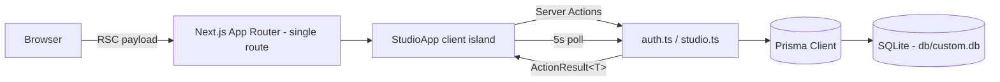

# AST Studio — Art Supply Tracker


A studio assistant built by an artist, for artists — a full clone of the
[Art Supply Tracker](https://studiobeta.artsupplytracker.com/dashboard/) artist beta,
rebuilt as a single Next.js application. Track supplies, projects, notes, and
creative workflows so you can spend less time searching and more time creating.

## Overview

Artists lose studio time hunting for supplies, remembering what a project
needed, and re-finding inspiration. AST Studio solves this with three
workspaces — **Projects**, **Supplies**, and **Inspiration** — wrapped in a
community chat panel, all on one dark, neon-accented dashboard. The original
production app is a Vite SPA on AWS Amplify (Cognito auth, AppSync GraphQL);
this clone reproduces its UI and behavior on a self-contained Next.js 16 stack
(Prisma + SQLite, Server Actions, session-cookie auth) so it runs anywhere
Node runs, with zero cloud dependencies.

## Key Features

| Feature | What it does |
|---|---|
| 🔐 Auth gate | Sign In / Create Account tabs, show-password toggle, forgot-password notice — scrypt-hashed passwords, httpOnly opaque session cookies |
| 🏠 Dashboard | "Today in the Studio" — Partner Spotlight, Art History, Artist Quote, Studio Spotlight cards + Studio Memory popover |
| 🎨 Projects | Status columns (Planned / In Progress / On Hold / Completed), Needs Sorting bucket, create/edit modal with budget, notes, and photo attachments |
| 🖌️ Supplies | Category grid (Paint, Brushes & Tools, Pastels, Paper, Canvas & Board, Mediums, Other) with per-category counts, condition tracking, barcode + location fields, project assignment |
| ✨ Inspiration | Today / Art History / Inspire Me feed tabs, artist quotes, studio spotlights, partner placeholders (15 seeded entries) |
| 💬 Studio Chat | Community message wall with 5-second polling that pauses on hidden tabs |
| 📦 Import / Export | Round-trip JSON backup — the export payload matches the original app's format (`app: "AST Studio"`, `version: 1`) |
| 📱 Responsive | Three fixed-height columns on desktop; mobile drawer sidebar and stacked community panel below `lg` |

## Architecture

| Layer | Technology | Version | Purpose |
|---|---|---|---|
| Web framework | Next.js (App Router) | 16.1.3 | Single-route server-rendered shell |
| UI runtime | React | 19.2.3 | RSC-first with client islands |
| Language | TypeScript (strict) | 5.9.3 | Type-safe end to end |
| Styling | Tailwind CSS (CSS-first `@theme`) | 4.1.18 | AST design tokens as theme variables |
| UI primitives | shadcn/ui + Radix | bundled | Dialogs, selects, toasts |
| Database | SQLite via Prisma ORM | 6.19.2 | Zero-config persistence |
| Validation | Zod | 4.3.5 | Every action boundary |
| Runtime | Bun | ≥ 1.3 | Package manager + scripts |



Mutations flow exclusively through **Server Actions** returning
`ActionResult<T>` unions — there are no REST endpoints for UI operations (the
lone route handler is a `/api` health probe).

## File Hierarchy

```
📂 prisma/            schema.prisma — 6 models (User, Session, Project, Supply, ChatMessage, InspirationEntry)
📂 public/assets/     Brand images (logo, portraits, artworks, ADC badge)
📂 scripts/           seed.ts — idempotent demo/bootstrap data
📂 src/
  📂 actions/         Server Actions: auth.ts, studio.ts (projects/supplies/chat/import)
  📂 app/             page.tsx (session-aware shell), layout.tsx, globals.css (@theme tokens)
  📂 components/
    📂 studio/        Login, shell, sidebar, 4 views, chat, 2 modals
    📂 ui/            shadcn/ui component set
  📂 lib/             db, auth (scrypt + sessions), result (ActionResult), validation (Zod), dto, studio-domain
📂 docs/              SSH push wrapper + operator runbook, reference prompts
```

## Quick Start

Requires Node.js ≥ 20 (or Bun ≥ 1.3).

```bash
bun install                 # or: npm install
cp .env.example .env        # DATABASE_URL for SQLite
bun run db:push             # create the schema in ./db/custom.db
bun run db:seed             # demo account + community content (idempotent)
bun run dev                 # http://localhost:3000
```

**Verify setup:** the login screen renders with "Join the Art Supply Tracker
Artist Beta". Sign in with the demo account below — the dashboard shows
`PROJECTS 0 · SUPPLIES 0 · INSPO 15 entries` and the Studio Chat history.

### Demo Account

| Field | Value |
|---|---|
| Email | `demo@artsupplytracker.com` |
| Password | `StudioDemo2026!` |

The demo account ships with an empty studio (matching the original beta's
fresh state) and the seeded community content. Create your own account via
the **Create Account** tab — registration is fully functional. This is a
documented demo credential, not a real secret; change it or delete the user
before exposing any public deployment.

## Environment Variables

| Variable | Required | Description | Default |
|---|---|---|---|
| `DATABASE_URL` | yes | SQLite file URL — relative paths resolve from `prisma/schema.prisma` | `file:../db/custom.db` |

## Testing & Quality

```bash
bun run lint        # ESLint (next/core-web-vitals + next/typescript)
bun run typecheck   # tsc --noEmit (strict)
bun run dev         # then exercise the flows below
```

Manual verification checklist (the golden paths):
1. Sign in / create an account / sign out.
2. Create a project → sidebar stats update immediately.
3. Add a supply → category count and low-condition badge update.
4. Send a chat message → it appears and survives reload.
5. Export Data → downloads `ast-studio-export-<ts>.json`; Import JSON with
   that file → "Import successful" notice and data restored.

## Design System

| Token | Hex | Usage |
|---|---|---|
| `ast-turquoise` | `#2ec4b6` | Studio Tools label, Need help? card, gradient start |
| `ast-cyan` | `#00e6ff` | My Studio heading, links, active states |
| `ast-lavender` | `#b78bff` | Section eyebrows, muted headings |
| `ast-pink` | `#ff4db8` | Community accents, primary buttons |
| `ast-purple` | `#5a3a8e` | Card borders (at 25–40% opacity) |
| `ast-blue` | `#4a69d6` | Utility buttons, quote text |
| `ast-body` | `#fff4d6` | Body text (at 60–90% opacity) |
| `ast-faint` | `#9f7fd6` | Placeholders, timestamps |
| Canvas | `#050009` | Page background |
| Cards | `#120724` | All card surfaces |
| Drawer | `#0B0018` | Mobile sidebar backdrop |

**Typography:** Inter (300–700) via `next/font`. Headline gradient:
`linear-gradient(90deg, #00E6FF, #2E64FF, #8D5CFF, #FF2FB3)`.

## Project Status

| Phase | Status | Key Deliverables |
|---|---|---|
| Clone build | ✅ Complete | Login, dashboard, projects, supplies, inspiration, chat, import/export |
| Verification | ✅ Complete | Lint + typecheck clean; browser E2E on all golden paths |
| Documentation | ✅ Complete | README, AGENTS.md, CLAUDE.md, Project_Architecture_Document.md |

Known intentional gaps (mirroring the original beta's placeholders): the
Partner Spotlight card and Inspire Me tab render "placeholder / coming soon"
states exactly like the production app.
